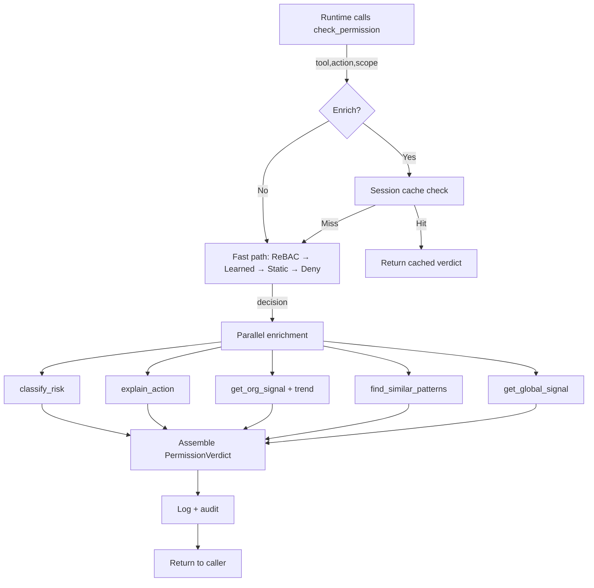

# Plan: Intelligent Permission Verdicts

## Architecture Decision

- **Decision**: Replace bare `PermissionDecision` enum returns with rich `PermissionVerdict` responses that include risk classification, command explanation, crowd signals, trend analysis, similarity matching, cross-org intelligence, and enhanced learning — all within the existing Aperture standalone package.
- **Rationale**: No production AI agent permission system combines enriched decisions + crowd signals + risk tiers + similarity matching + adaptive learning. This fills a genuine market gap validated by research across OPA, Cedar, VirusTotal, Chrome Safe Browsing, SpamAssassin, CVSS, and MITRE ATT&CK.
- **Tradeoffs**: More complex permission check path (mitigated by `enrich` flag for fast-path callers). More database queries per enriched check (mitigated by optional enrichment and future caching).
- **Alternatives Considered**: LLM-based command explanation (rejected — breaks zero-LLM-cost principle). k-anonymity for cross-org (rejected — insufficient privacy guarantees per research). Generic edit distance for similarity (rejected — domain-specific functions are more accurate).

## Component Specifications

### New Files

#### Module: `aperture/aperture/models/verdict.py`
**Public API:**
```python
class RiskTier(str, Enum):
    LOW = "low"
    MEDIUM = "medium"
    HIGH = "high"
    CRITICAL = "critical"

@dataclass
class OrgSignal:
    total_decisions: int
    allow_count: int
    deny_count: int
    allow_rate: float
    unique_humans: int
    last_decision_at: datetime
    first_decision_at: datetime
    trend: str  # "toward_approve" | "toward_deny" | "stable" | "mixed" | "new" | "insufficient_data"
    velocity: float  # decisions per day

@dataclass
class SimilarPattern:
    tool: str
    action: str
    scope: str
    similarity: float  # 0.0-1.0
    allow_rate: float
    total_decisions: int
    unique_humans: int

@dataclass
class RiskAssessment:
    tier: RiskTier
    score: float  # 0.0-1.0
    factors: list[str]  # human-readable: ["destructive_action", "broad_scope"]
    reversible: bool

@dataclass
class GlobalSignal:
    total_orgs: int
    estimated_allow_rate: float
    confidence_interval: tuple[float, float]  # (low, high)
    sample_size: int

@dataclass
class PermissionVerdict:
    # Core decision (backward compatible)
    decision: PermissionDecision  # ALLOW / DENY / ASK
    decided_by: str  # "static_rule" / "auto_learned" / "rebac" / "session_memory"

    # Risk assessment
    risk: RiskAssessment

    # Command explanation
    explanation: str  # "Run shell command: rm -rf ./build/ (destructive, irreversible)"

    # Crowd signal from this org
    org_signal: OrgSignal | None  # None if no history

    # Similar patterns (when no exact match)
    similar_patterns: list[SimilarPattern]  # max 5, sorted by similarity

    # Cross-org intelligence
    global_signal: GlobalSignal | None  # None if insufficient data or disabled

    # Actionable context
    auto_approve_distance: int | None  # "7 more allows → automatic" or None
    recommendation: str  # human-readable action suggestion
    recommendation_code: str  # "auto_approve" / "review" / "keep_asking" / "suggest_rule" / "caution"
```

**Preconditions**: PermissionDecision enum must exist (it does).
**Postconditions**: All fields populated. `decision` field preserves backward compat.
**Invariants**: `risk.tier` is always set. `explanation` is always non-empty. `org_signal` is None only when zero decision history exists.

---

#### Module: `aperture/aperture/permissions/risk.py`
**Public API:**
```python
def classify_risk(tool: str, action: str, scope: str) -> RiskAssessment
```

**Design (OWASP likelihood × impact with CRITICAL override):**

```python
# Tool danger (likelihood dimension)
TOOL_DANGER = {
    "shell": 0.9, "database": 0.8, "network": 0.7,
    "filesystem": 0.6, "api": 0.5, "browser": 0.4, "read": 0.1,
}

# Action severity (impact dimension)
ACTION_SEVERITY = {
    "execute": 0.9, "drop": 0.95, "delete": 0.8, "truncate": 0.85,
    "write": 0.5, "create": 0.3, "modify": 0.5,
    "read": 0.1, "list": 0.1, "get": 0.1,
}

# CRITICAL overrides — if scope matches any of these, result is always CRITICAL
CRITICAL_PATTERNS = [
    "rm -rf /",  "rm -rf /*",             # root filesystem destruction
    "DROP DATABASE*", "DROP TABLE*",       # database destruction
    "format *", "mkfs*",                   # disk formatting
    "> /dev/*",                            # device overwrite
    ":(){ :|:& };:",                       # fork bomb
    "chmod -R 777 /",                      # permission destruction
    "dd if=/dev/zero*",                    # disk wipe
]

def scope_breadth(scope: str) -> float:
    """Score 0.0 (very specific) to 1.0 (dangerously broad)."""
    # Wildcards, root paths, recursive flags increase breadth
    # Specific filenames, relative paths decrease breadth

def classify_risk(tool: str, action: str, scope: str) -> RiskAssessment:
    # 1. CRITICAL override check
    if matches_critical_pattern(scope): return CRITICAL

    # 2. OWASP-style: likelihood × impact
    likelihood = TOOL_DANGER.get(tool, 0.5)
    breadth = scope_breadth(scope)
    severity = ACTION_SEVERITY.get(action, 0.5)
    impact = severity * (0.6 + 0.4 * breadth)  # breadth amplifies severity
    score = likelihood * impact

    # 3. Map to tier
    if score >= 0.6: HIGH
    elif score >= 0.3: MEDIUM
    else: LOW

    # 4. Reversibility
    reversible = action in {"read", "list", "get", "create"}  # create can be undone by delete
```

**Preconditions**: tool, action, scope are non-empty strings.
**Postconditions**: Returns valid RiskAssessment with tier, score, factors list, and reversible flag.
**Error handling**: Unknown tools/actions default to 0.5 (MEDIUM assumed).

---

#### Module: `aperture/aperture/permissions/explainer.py`
**Public API:**
```python
def explain_action(tool: str, action: str, scope: str, risk: RiskAssessment) -> str
```

**Design:**

```python
# Template registry
TEMPLATES = {
    ("shell", "execute"): "Run shell command: {scope}",
    ("filesystem", "read"): "Read file: {scope}",
    ("filesystem", "write"): "Write to file: {scope}",
    ("filesystem", "delete"): "Delete: {scope}",
    ("database", "query"): "Execute database query on: {scope}",
    ("database", "drop"): "Drop database object: {scope}",
    ("api", "call"): "Make API request to: {scope}",
    ("api", "post"): "Send POST request to: {scope}",
    ("network", "connect"): "Open network connection to: {scope}",
    # ... extensible
}

# Destructive flag detection in scope
DESTRUCTIVE_MARKERS = ["rm ", "delete", "drop", "truncate", "format", "-rf", "--force", "overwrite"]
BROAD_MARKERS = [" -R", " -r", "**", "/*", " *"]

def explain_action(tool, action, scope, risk):
    base = TEMPLATES.get((tool, action), f"Perform {action} using {tool} on: {scope}")
    annotations = []
    if not risk.reversible: annotations.append("irreversible")
    if risk.tier in (HIGH, CRITICAL): annotations.append(risk.tier.value + " risk")
    for marker in DESTRUCTIVE_MARKERS:
        if marker in scope.lower(): annotations.append("destructive"); break
    for marker in BROAD_MARKERS:
        if marker in scope: annotations.append("recursive/broad"); break

    if annotations:
        return f"{base} ({', '.join(annotations)})"
    return base
```

**Fallback**: Unknown (tool, action) pairs get generic "Perform {action} using {tool} on: {scope}".

---

#### Module: `aperture/aperture/permissions/crowd.py`
**Public API:**
```python
def get_org_signal(
    tool: str, action: str, scope: str,
    organization_id: str = "default",
    lookback_days: int = 90,
) -> OrgSignal | None

def compute_trend(decisions: list[PermissionLog]) -> str

def compute_auto_approve_distance(
    org_signal: OrgSignal,
    min_decisions: int,
    threshold: float,
) -> int | None
```

**Design:**
- `get_org_signal`: queries PermissionLog for human decisions matching (tool, action, scope) with fnmatch. Returns None if zero history.
- `compute_trend`: splits decisions by time into two halves, compares allow rates. Returns "toward_approve", "toward_deny", "stable", "mixed", "new", or "insufficient_data".
- `compute_auto_approve_distance`: calculates how many more consistent allows are needed to reach auto-approve threshold. Returns None if already auto-approved or if trend is toward deny.

---

#### Module: `aperture/aperture/permissions/similarity.py`
**Public API:**
```python
def find_similar_patterns(
    tool: str, action: str, scope: str,
    organization_id: str = "default",
    min_similarity: float = 0.5,
    limit: int = 5,
) -> list[SimilarPattern]
```

**Design — domain-specific distance functions:**

```python
# Tool/action taxonomy (MITRE ATT&CK inspired)
TOOL_TAXONOMY = {
    "shell": {"category": "execution", "danger": 0.9},
    "filesystem": {"category": "file_access", "danger": 0.6},
    "database": {"category": "data_access", "danger": 0.8},
    "api": {"category": "network", "danger": 0.5},
    "network": {"category": "network", "danger": 0.7},
    "read": {"category": "observation", "danger": 0.1},
}

ACTION_TAXONOMY = {
    "execute": {"category": "modify", "severity": 0.9},
    "delete": {"category": "modify", "severity": 0.8},
    "drop": {"category": "modify", "severity": 0.95},
    "write": {"category": "modify", "severity": 0.5},
    "create": {"category": "modify", "severity": 0.3},
    "read": {"category": "observe", "severity": 0.1},
    "list": {"category": "observe", "severity": 0.1},
    "get": {"category": "observe", "severity": 0.1},
}

def tool_action_similarity(t1, a1, t2, a2) -> float:
    """Taxonomy tree distance normalized to 0-1."""
    tool_sim = 1.0 if t1 == t2 else (0.7 if same_category else 0.3)
    action_sim = 1.0 if a1 == a2 else (0.7 if same_category else 0.3)
    return tool_sim * 0.5 + action_sim * 0.5

def scope_similarity(s1, s2) -> float:
    """Domain-specific scope matching."""
    # 1. Exact match: 1.0
    # 2. Path prefix: shared prefix length / max length
    #    /home/user/docs/ vs /home/user/docs/sub/ → high
    #    /home/user/docs/ vs /etc/passwd → low
    # 3. Command similarity (for shell scopes):
    #    Parse command name + target separately
    #    "rm -rf ./build/" vs "rm -rf ./dist/" → same command, different target
    # 4. Glob containment: if s1 glob-matches s2 or vice versa → 0.8

def resource_similarity(r1, r2) -> float:
    """If resource field exists, use it for intent matching."""
    # Exact resource match → 1.0
    # Path prefix match → scaled
    # No resource → 0.0 (fall through to scope_similarity)

def find_similar_patterns(tool, action, scope, organization_id, min_similarity, limit):
    # 1. Query all distinct (tool, action, scope) from PermissionLog for this org
    # 2. Score each against (tool, action, scope) input
    #    combined = taxonomy * 0.35 + scope_sim * 0.40 + resource_sim * 0.25
    # 3. Filter by min_similarity, sort desc, take top `limit`
    # 4. For each match, compute allow_rate and total_decisions
```

---

#### Module: `aperture/aperture/permissions/resource.py`
**Public API:**
```python
def extract_resource(tool: str, action: str, scope: str) -> str
```

**Design:**
```python
def extract_resource(tool: str, action: str, scope: str) -> str:
    """Normalize scope to the target resource regardless of mechanism."""
    # shell.execute "rm -rf ./build/" → "./build/"
    # shell.execute "cat src/main.py" → "src/main.py"
    # filesystem.delete "./build/" → "./build/"
    # api.call "https://api.example.com/users" → "api.example.com/users"
    # database.query "SELECT * FROM users" → "users"

    if tool == "shell":
        return _parse_shell_target(scope)
    elif tool in ("filesystem", "file"):
        return scope  # scope IS the resource
    elif tool == "api":
        return _strip_protocol(scope)
    elif tool == "database":
        return _parse_sql_target(scope)
    return scope  # fallback: scope is resource

def _parse_shell_target(scope: str) -> str:
    """Extract the file/directory target from a shell command."""
    # Handle: rm, mv, cp, cat, chmod, chown, mkdir, rmdir, touch
    # Parse last positional argument after flags
    # "rm -rf ./build/" → "./build/"
    # "cat -n src/main.py" → "src/main.py"
```

Also: add `resource: str = ""` field to `PermissionLog` model and populate it on every `_log()` call.

---

#### Module: `aperture/aperture/permissions/intelligence.py`
**Public API:**
```python
class IntelligenceEngine:
    def report_decision(
        self, tool: str, action: str, scope: str,
        decision: PermissionDecision, organization_id: str,
        epsilon: float = 1.0,
    ) -> None
    """Report a decision with local differential privacy."""

    def get_global_signal(
        self, tool: str, action: str, scope: str,
    ) -> GlobalSignal | None
    """Get cross-org signal. Returns None if insufficient data."""
```

**New model: `aperture/aperture/models/intelligence.py`**
```python
class GlobalPermissionStat(SQLModel, table=True):
    __tablename__ = "global_permission_stats"

    id: int | None = Field(default=None, primary_key=True)
    tool: str = Field(index=True)
    action: str = Field(index=True)
    scope_pattern: str = Field(index=True)  # generalized scope
    total_orgs: int = 0
    noisy_allow_count: float = 0.0  # DP-protected
    noisy_deny_count: float = 0.0  # DP-protected
    noisy_total: float = 0.0
    estimated_allow_rate: float = 0.0  # debiased
    confidence_low: float = 0.0
    confidence_high: float = 1.0
    last_updated: datetime = Field(default_factory=datetime.utcnow)
```

**Local differential privacy (RAPPOR-inspired):**
```python
import random

def randomized_response(true_value: bool, epsilon: float) -> bool:
    """Local DP: with probability p report truth, else random."""
    p = math.exp(epsilon) / (1 + math.exp(epsilon))
    if random.random() < p:
        return true_value
    return random.random() < 0.5

def debias(noisy_rate: float, epsilon: float) -> float:
    """Recover estimated true rate from noisy observations."""
    p = math.exp(epsilon) / (1 + math.exp(epsilon))
    return (noisy_rate - 0.5 * (1 - p)) / (2 * p - 1)
```

**Scope generalization:**
```python
def generalize_scope(scope: str) -> str:
    """Replace specific paths/names with patterns for privacy."""
    # "/Users/john/project/src/main.py" → "*.py"
    # "rm -rf ./build/" → "rm * ./*/"
    # "DROP TABLE users" → "DROP TABLE *"
    # Preserves command structure but removes identifying details
```

**Privacy rules:**
- `min_orgs_threshold = 5` (configurable)
- Privacy budget tracking via epsilon per metric
- Scope generalization before storage
- Never store org_id in global tables

---

### Modified Files

#### `aperture/aperture/permissions/engine.py`
**Changes:**
- `check()` gains `enrich: bool = False` parameter
- When `enrich=True`: calls risk classifier, explainer, crowd signal, similarity, intelligence → returns `PermissionVerdict`
- When `enrich=False`: returns `PermissionVerdict` with only decision + decided_by + risk (cheap fields)
- Session-scoped memory: new `_session_cache: dict[tuple, PermissionDecision]` checked before all other resolution steps
- `_log()` now also extracts and stores `resource` field
- `record_human_decision()` calls `intelligence.report_decision()` for cross-org learning

#### `aperture/aperture/permissions/learning.py`
**Changes:**
- Exponential decay: `_weighted_count()` applies `exp(-lambda * age_days)` to each decision
- Half-life configurable via `APERTURE_LEARNING_DECAY_HALF_LIFE_DAYS` (default 30)
- Per-user pattern tracking (group by decided_by in addition to tool/action/scope)
- Reputation-weighted voting: weight = 1.0 + (success_rate - 0.5) where success_rate comes from HumanDecisionRecord.task_outcome
- Warning fatigue detection: if same user asked >N times for similar pattern, recommendation becomes "suggest_rule"
- Actionable recommendations with human-readable strings

#### `aperture/aperture/models/permission.py`
**Changes:**
- Add `resource: str = ""` field to `PermissionLog`

#### `aperture/aperture/config.py`
**New settings:**
```python
# Risk
risk_classification_enabled: bool = True

# Intelligence
intelligence_enabled: bool = False  # opt-in for cross-org
intelligence_epsilon: float = 1.0  # local DP noise level
intelligence_min_orgs: int = 5  # k-anonymity supplement

# Learning enhancements
learning_decay_half_life_days: int = 30
learning_session_memory_enabled: bool = True
learning_reputation_enabled: bool = False  # opt-in, needs outcome data
learning_fatigue_threshold: int = 10  # suggest rule after N same-pattern asks
```

#### `aperture/aperture/api/routes/permissions.py`
**Changes:**
- `CheckResponse` → `VerdictResponse` with all PermissionVerdict fields as JSON
- `POST /permissions/check` returns full verdict when `?enrich=true` query param
- New endpoint: `GET /permissions/similar?tool=X&action=Y&scope=Z`
- New endpoint: `GET /permissions/explain?tool=X&action=Y&scope=Z`

#### `aperture/aperture/api/app.py`
**Changes:**
- Add intelligence router: `app.include_router(intelligence.router, prefix="/intelligence", tags=["intelligence"])`

#### New: `aperture/aperture/api/routes/intelligence.py`
- `GET /intelligence/global-signal?tool=X&action=Y&scope=Z`

#### `aperture/aperture/mcp_server.py`
**Changes:**
- `check_permission` tool returns enriched verdict JSON (risk, explanation, crowd signal, similar patterns)
- New tool: `explain_action` — just explanation + risk without full permission check
- Updated `approve_action`/`deny_action` to trigger intelligence reporting

#### `aperture/aperture/db/engine.py`
**Changes:**
- `_import_all_models()` adds `import aperture.models.intelligence`

---

## Interface Connections

```mermaid
graph LR
    API[API/MCP Request] -->|check(tool,action,scope,enrich=true)| Engine[PermissionEngine]
    Engine -->|tool,action,scope| Risk[risk.classify_risk]
    Engine -->|tool,action,scope,risk| Explainer[explainer.explain_action]
    Engine -->|tool,action,scope,org_id| Crowd[crowd.get_org_signal]
    Crowd -->|decisions| Trend[crowd.compute_trend]
    Engine -->|tool,action,scope,org_id| Similarity[similarity.find_similar]
    Engine -->|tool,action,scope| Intelligence[intelligence.get_global_signal]
    Engine -->|all signals| Verdict[PermissionVerdict]
    Verdict -->|JSON| API

    RecordDecision -->|decision| Intelligence
    Intelligence -->|randomized_response| GlobalStats[global_permission_stats table]
```

## Data Flow



## Files to Create or Modify

| File | Action | Purpose |
|------|--------|---------|
| `aperture/aperture/models/verdict.py` | Create | PermissionVerdict, RiskTier, OrgSignal, SimilarPattern, RiskAssessment, GlobalSignal dataclasses |
| `aperture/aperture/models/intelligence.py` | Create | GlobalPermissionStat SQLModel table |
| `aperture/aperture/permissions/risk.py` | Create | Risk classification (OWASP likelihood×impact + CRITICAL override) |
| `aperture/aperture/permissions/explainer.py` | Create | Template-based command explanations |
| `aperture/aperture/permissions/crowd.py` | Create | Org signal aggregation + trend analysis |
| `aperture/aperture/permissions/similarity.py` | Create | Domain-specific similarity matching |
| `aperture/aperture/permissions/resource.py` | Create | Scope-to-resource normalization |
| `aperture/aperture/permissions/intelligence.py` | Create | Cross-org DP intelligence engine |
| `aperture/aperture/api/routes/intelligence.py` | Create | Intelligence API endpoints |
| `aperture/aperture/permissions/engine.py` | Modify | Return PermissionVerdict, add session memory, wire all components |
| `aperture/aperture/permissions/learning.py` | Modify | Exponential decay, reputation-weighted voting, fatigue detection |
| `aperture/aperture/permissions/__init__.py` | Modify | Export new modules |
| `aperture/aperture/models/permission.py` | Modify | Add resource field to PermissionLog |
| `aperture/aperture/models/__init__.py` | Modify | Export new models |
| `aperture/aperture/config.py` | Modify | New settings for risk, intelligence, learning |
| `aperture/aperture/api/routes/permissions.py` | Modify | VerdictResponse, enrich param, new endpoints |
| `aperture/aperture/api/app.py` | Modify | Add intelligence router |
| `aperture/aperture/mcp_server.py` | Modify | Enriched check_permission, new explain_action tool |
| `aperture/aperture/db/engine.py` | Modify | Import intelligence model |
| `aperture/tests/test_risk.py` | Create | Risk classification tests |
| `aperture/tests/test_explainer.py` | Create | Explanation template tests |
| `aperture/tests/test_crowd.py` | Create | Crowd signal + trend tests |
| `aperture/tests/test_similarity.py` | Create | Similarity matching tests |
| `aperture/tests/test_resource.py` | Create | Resource extraction tests |
| `aperture/tests/test_intelligence.py` | Create | Cross-org DP intelligence tests |
| `aperture/tests/test_permissions.py` | Modify | Update for PermissionVerdict returns |
| `aperture/tests/test_api.py` | Modify | Update for enriched API responses |

## Test Strategy

### Risk Classification (`test_risk.py`)
- `test_critical_override_rm_rf_root` — rm -rf / always CRITICAL regardless of other factors
- `test_critical_override_drop_database` — DROP DATABASE always CRITICAL
- `test_shell_execute_is_high` — shell.execute with moderate scope → HIGH
- `test_filesystem_read_is_low` — filesystem.read → LOW
- `test_unknown_tool_defaults_medium` — unknown tools get 0.5 danger
- `test_scope_breadth_wildcards` — wildcards increase breadth score
- `test_scope_breadth_specific_file` — specific file paths are low breadth
- `test_reversibility` — read/list/get are reversible, delete/execute are not
- `test_owasp_likelihood_times_impact` — score = likelihood × impact

### Explainer (`test_explainer.py`)
- `test_shell_execute_template` — "Run shell command: ls -la"
- `test_filesystem_delete_template` — "Delete: ./build/"
- `test_destructive_annotation` — scope with "rm -rf" gets "(destructive, irreversible)"
- `test_unknown_tool_fallback` — generic template for unknown tools
- `test_high_risk_annotation` — HIGH/CRITICAL risk gets risk label in explanation
- `test_broad_scope_annotation` — recursive/wildcard scopes annotated

### Crowd Signal (`test_crowd.py`)
- `test_org_signal_from_history` — computes correct allow_rate, counts
- `test_org_signal_no_history_returns_none` — no data → None
- `test_trend_toward_approve` — recent half more permissive than older half
- `test_trend_toward_deny` — recent half more restrictive
- `test_trend_stable` — consistently high/low rate
- `test_trend_insufficient_data` — fewer than 4 decisions → "insufficient_data"
- `test_auto_approve_distance_calculation` — correct distance to threshold
- `test_velocity_computation` — decisions per day

### Similarity (`test_similarity.py`)
- `test_exact_match_score_1` — same tool/action/scope → similarity 1.0
- `test_same_tool_action_similar_scope` — "rm -rf ./build/" vs "rm -rf ./dist/" → high similarity
- `test_different_tool_same_resource` — filesystem.delete("./build/") vs shell.execute("rm -rf ./build/") → moderate similarity via resource matching
- `test_completely_different_is_low` — filesystem.read vs database.drop → low similarity
- `test_min_similarity_threshold` — results below 0.5 excluded
- `test_limit_respected` — returns at most `limit` results
- `test_path_prefix_distance` — /home/user/docs/ close to /home/user/docs/sub/
- `test_taxonomy_same_category` — shell and database both "modify" category → partial match

### Resource Extraction (`test_resource.py`)
- `test_shell_rm_extracts_target` — "rm -rf ./build/" → "./build/"
- `test_shell_cat_extracts_file` — "cat src/main.py" → "src/main.py"
- `test_filesystem_scope_is_resource` — scope passes through unchanged
- `test_api_strips_protocol` — "https://api.example.com/users" → "api.example.com/users"
- `test_unknown_tool_returns_scope` — fallback is scope itself

### Intelligence (`test_intelligence.py`)
- `test_randomized_response_preserves_bias` — over many trials, debiased estimate ≈ true rate
- `test_debias_correctness` — mathematical debiasing formula is correct
- `test_scope_generalization` — specific paths → patterns
- `test_min_orgs_threshold` — returns None when fewer than min_orgs
- `test_report_and_retrieve_signal` — end-to-end: report decisions, get global signal
- `test_privacy_no_org_id_stored` — global stats table has no org_id column

### Updated Permission Tests (`test_permissions.py`)
- Existing tests updated: `engine.check()` now returns `PermissionVerdict`, assert on `.decision`
- `test_enriched_check_includes_risk` — enrich=True populates risk field
- `test_enriched_check_includes_explanation` — enrich=True populates explanation
- `test_enriched_check_includes_org_signal` — enrich=True populates org_signal after recording decisions
- `test_session_memory_skips_reask` — second check in same session returns cached decision
- `test_exponential_decay_old_decisions_weigh_less` — old decisions have less impact on learning

### Updated API Tests (`test_api.py`)
- `test_check_returns_verdict` — response includes risk, explanation
- `test_check_enrich_param` — ?enrich=true returns full verdict
- `test_similar_endpoint` — GET /permissions/similar returns similar patterns
- `test_explain_endpoint` — GET /permissions/explain returns explanation + risk

## Verification Commands

```bash
# Run all tests
cd aperture && python -m pytest tests/ -v

# Run specific test files
python -m pytest tests/test_risk.py -v
python -m pytest tests/test_explainer.py -v
python -m pytest tests/test_crowd.py -v
python -m pytest tests/test_similarity.py -v
python -m pytest tests/test_resource.py -v
python -m pytest tests/test_intelligence.py -v
python -m pytest tests/test_permissions.py -v
python -m pytest tests/test_api.py -v

# Verify imports work
python -c "from aperture.models.verdict import PermissionVerdict, RiskTier"
python -c "from aperture.permissions.risk import classify_risk"
python -c "from aperture.permissions.explainer import explain_action"
python -c "from aperture.permissions.crowd import get_org_signal"
python -c "from aperture.permissions.similarity import find_similar_patterns"
python -c "from aperture.permissions.intelligence import IntelligenceEngine"
```

## Acceptance Criteria

- [ ] `engine.check()` returns `PermissionVerdict` (backward compat: `.decision` still works)
- [ ] Risk classification covers all CRITICAL patterns (rm -rf /, DROP DATABASE, etc.)
- [ ] Explanations are generated for all common tool/action pairs
- [ ] Crowd signal shows allow/deny rates from org history
- [ ] Trend analysis correctly detects toward_approve / toward_deny
- [ ] Similarity matching finds related patterns with domain-specific distance
- [ ] Cross-org intelligence uses local differential privacy
- [ ] Learning uses exponential decay with configurable half-life
- [ ] Session memory prevents re-asking for same action in same session
- [ ] All 23 existing tests still pass (backward compat)
- [ ] 30+ new tests pass across 6 new test files
- [ ] API endpoints return enriched verdicts
- [ ] MCP tools return enriched verdicts
- [ ] Zero LLM calls — all new logic is deterministic
- [ ] No new external dependencies (only stdlib `math`, `random`, `re`)
